# 写作

# 六级分值表

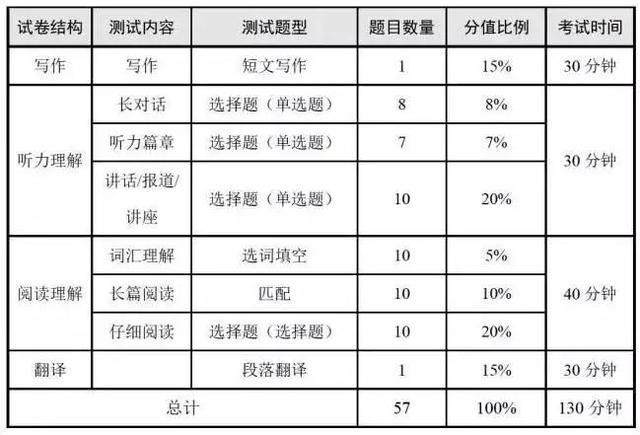

1. 写作25min

2. 听力35min

3. 仔细阅读20min

4. 长篇阅读15分钟

5. 翻译25分钟

6. 剩下选词填空。

# 写作

小于25min结束，必须结束，剩下的5min给听力。

**六级作文常见题型：**

论说文（最重要）、谚语警句、图画图表、书信

## 1\.替换词

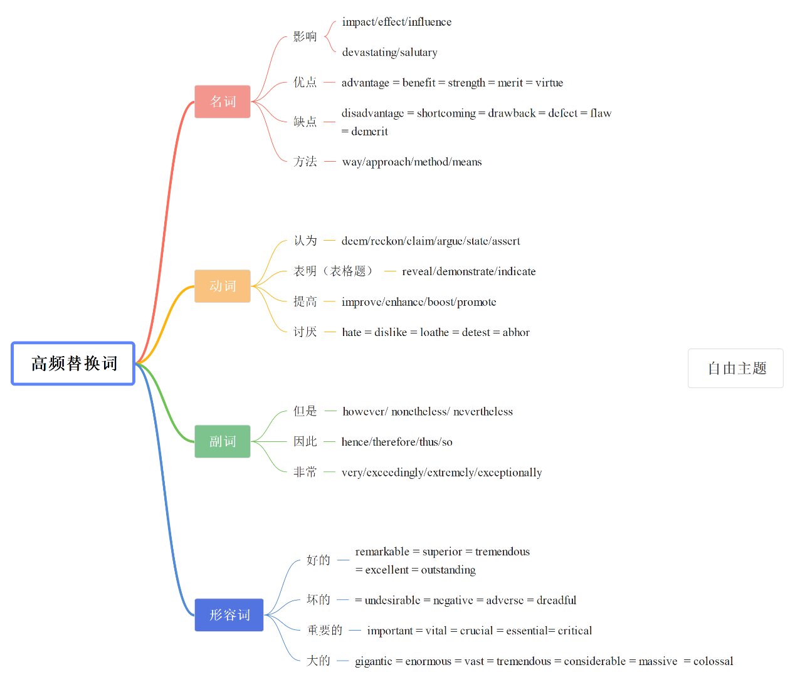

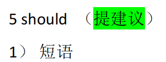

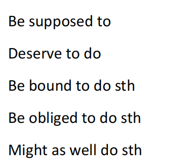

名词：

难题：conundrum, paradigm, 困境 dilemma, predicament ,危险 peril,影响 remification

动词：

增加：augment。加剧：exacerbate\.支持：bolster\.破坏：undermine ,限制：curtail\.减轻：mitigate

形容词：

即将发生的：imminent 禁止的：prohibitive,普遍存在的：pervasive，有帮助的：conducive,不可避免的：inevitable，关键的：pivotal

副词：大幅度的：substantially，非常：remarkably=very,然而：nevertheless,尽管：nonetheless,因此：consequently

The development of technology promote the economy\.

The booming of technology substantially bolster the economy\.

## 2\.短句

CHEMIST

C=Convenience

xxx is tremendously/exceedingly convenient\.

xxx is by no means convenient\.

H=Health\&Safety

improve health=enhance/boost/promote physical and mental well\-being

impair/jeopardize/be detrimental to \+health

E=Environment

save/conserve/protect/safeguard/preserve \+the environment

harm/wreak havoc on/aggravate \+the environment

M=Money

cheap=economical=cost\-effective A costs considerably less\(than B\)

expensive=exorbitant=pricey

I=Interpersonal relationship \&Relax

improve interpersonal relationship

=enlarge social circle

=expand social network

=build an intimate rapport

relax=loosen up=unwind

S=Success

boost academic/job performance

achieve academic/career success

broaden horizons=expand vision

T=Technology

foster valuable qualities and skills

communication skills , teamwork, persistence, diligence, self\-discipline, confidence, innovation, independence\.

名词性从句

A怎么了B:A hit B

怎么了B的东西是A: what hit B is A

What does carry some weight is A

非限制性定语从句

A怎么了B, which怎么了

保护动物可以保护环境，这对人类很重要

protecting animals can protect the environment, which is of great significance to human beings\.

虚拟语气

如果怎么样，A怎么了B

if there are many people, l will not be happy\.

Be there many people, l will not be happy

强调句

主谓宾

it is主语that谓宾

多做公共交通，有助于环境保护

乘坐公共交通会减少汽车的数量，进而缓解空气污染。

what can decrease the number of vehicles is the frequentuse of public transport, which would remit the air

pollution\.

而如果空气质量更好，人们的生活也会更快乐。

If the air quality could be better, our lives would also be happier\.

Be the air quality better, our lives would also be happier\.

## 3\.文章 

### 雅思大作文

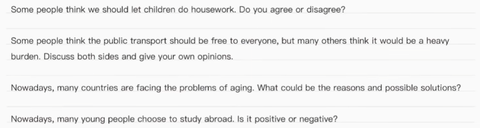

四种题型：agree or disagree, discuss, reasons and solutions and positive and negative\.

题目给观点或现象去分析

#### 第一段：背景\+点题\+开门见山

背景：In contemporary society, the issue of xxx has always been a matter of public interest\.在当今社会，xxx的问题总是引发人们的关注。

点题：

Agree: While some individuals contend that xxx, this topic is still a source of controversy\. 虽然有些人认为xxx，但这个话题仍然是一个争议的来源。

Discuss: Some individuals champion the notion that xxx, while a significant number of others posit that xxx\. 有些人支持xxx的观点，而相当多的人则认为xxx。posit 认定

现象：An increasing number of individuals are discovering that xxx\.

开门见山：

agree: Despite recognizing the merits and drawbacks behind the viewpoint, I am inclined to support/oppose this viewpoint\. 尽管认识到这一观点背后的优点和缺点，我还是倾向于支持/反对它。

Discuss: Despite recognizing the validities of both sides, I am nevertheless more inclined to support the former/latter\. validities 正确性 尽管我承认双方的观点都有道理，但我更倾向于支持前者/后者。

2 tasks: This essay aims to delve into the analysis of the causes and potential influences behind the phenomenon\. 本文旨在深入分析这一现象背后的原因和潜在影响。

优缺点：Despite recognizing the merits and drawbacks behind the phenomenon, I am inclined to believe it has more advantages/disadvantages\.

#### 中间段

分论点\+原因\+例子\+呼应主论点

1. 经济

2. 个人发展

3. 社会稳定

4. 快乐幸福

5. 长远利益

6. 社会风气

7. 环境

从七大方向找到分论点

On one hand, xxx\. This is mainly because xxx\. Furthermore, xxx is crucial to the development of a country\. For example, according to a study by the University of Hong Kong in 2019,there is a clear negative correlation between xxx and xxx, indicating that the higher xxx，the lower the xxx\. Therefore，xxx can be very beneficial in terms of xxx\.

agree:

for example

As a case in point, a recent research in relevant area brought to light that xxx         , fueling extensive public fascination and argument\. 作为一个恰当的例子，最近在相关领域的一项研究表明，xxx, 引发了广泛的公众关注和争论

To deepen this elucidation, as exposed by the most up\-to\-date government report, xxx\.

Many xxx in China have benefited a lot through xxx, and an increasing number of others are trying to do so\.

The problems of xxx in China is getting increasingly serious, and an effective solution has been called for long\.

#### 结尾段

agree and discuss

In conclusion, I remain unwavering in my conviction that xxx\. While there may be some potential drawbacks behind it, the evidence I presented above thoroughly supports my stance\. 

resolutely adv\.坚决地；毅然地 虽然它背后可能有一些潜在的缺点，但我上面提出的证据完全支持了我的立场。

优缺点

优点或缺点二选一In conclusion, I remain unwavering in my conviction that the advantages/disadvantages behind xxx carry more weight\. While there may be some potential drawbacks behind it, the evidence I presented above thoroughly supports my stance\.

优点和缺点

In conclusion, the issue xxx is of multiplicity\. It is imperative to acknowledge that it is may bring the merits that xxx, and the shortcomings that xxx should never be ignored either\.

2 tasks

In conclusion, the dilemma of xxx is multifaceted and intricate issue with an array of underlying reasons and wide\-ranging consequences\. It is imperative to acknowledge that it is caused by xxx and my bring the effects of xxx\.

In conclusion, while the dilemma of xxx is incontrovertibly complex and multi\-dimensional, it is still imperative to acknowledge that it is caused by xxx and may be solved through xxx\.

### 论说文

#### 第一段 引出主题 \+ 个人观点

There has been much discussion revolving around the issue of \(whether\)\. From my standpoint, I am in line with the argument/view/opinion that【同位语从句改写题目】

#### 第二段   原因分析或举例

It is superficially a simple phenomenon, but when subjected to analysis, it has its fundamental reasons\.

它表面上是一个简单的现象，但经过分析，它有其根本原因。

Although so abundant cases can support my simple view, the following one is most favorable\.

尽管如此丰富的案例可以支持我的简单观点，但以下案例是最有利的。

In the first place, the prime/key/major\+题干东西/reasons/methods is undeniably xxx\.毫无疑问的

In the next place, the second noteworthy \+ 题干东西/reasons/methods is xxx\.第二个值得关注的原因/方法/东西是

The most important thing, confronted the current situation, is not to suggest, but instead to do\. 

面对当前形势，最重要的不是建议，而是做。

#### 第三段

In a nutshell, in light of the aforesaid/aforementioned/above factors, it is safe/natural/reasonable to reach the conclusion that 【形式主语】

Only via this approach can people have a better future\.

only via this approach can people have a better future\.

### 文字作文

#### 第一段

第1\-2句总结作者观点

1\)The above excerpt argues/holds that材料中作者的观点

上述的材料节选认为……

2\)According to the above material, we can know that the author believes that材料中

作者的观点

根据上述材料，我们可以知道作者认为\.\.\.\.\.\.\.

第3句:发表自己的观点

\(同意，或者反对，或者部分同意部分反对\)

同意: ,I totally agree with the author's argument that\.\.\.我完全同意作者对……的观点

反对: I have some reservations about … /I strongly object to the idea that \.\.\. ,because\.\.\.

我对……持保留意见/我强烈反对……

部分同意: Ⅰ partly agree with the author's argument that \(\+作者观点\)。It is reasonable to say \.\.，but maybe biased to say\.\.\.

我部分同意作者的观点。我认为说xxx是合理的，但是说xxx可能有失偏颇。

#### 第二段

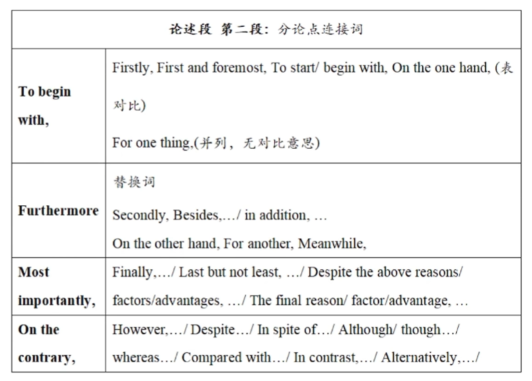

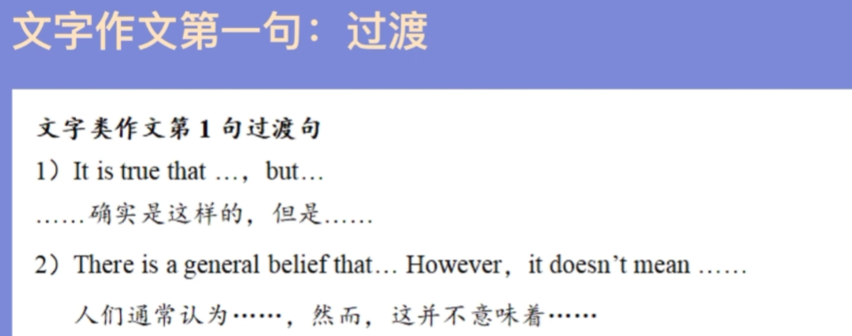

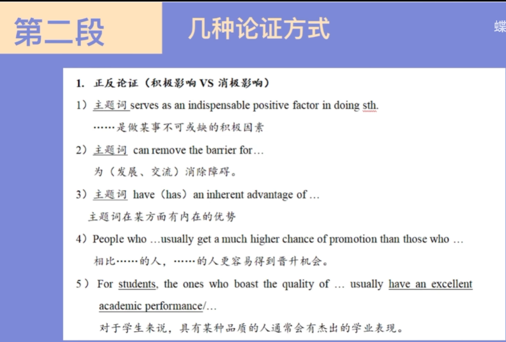

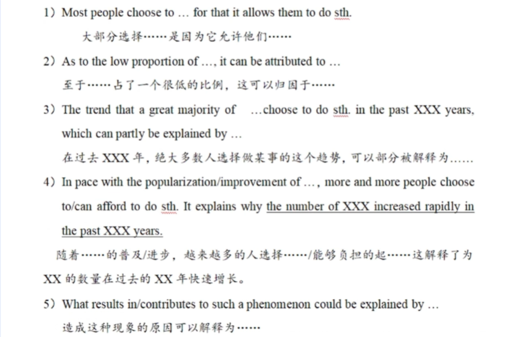

#### 第三段

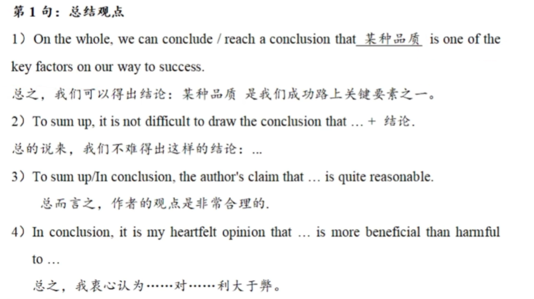

### 谚语警句类

#### 第一段  引出主题 \+ 解释你对这句话的理解

第一句:解释这句话的意思

the meaning of the saying seems that \.\.\.

第二句：我的观点

From my standpoint, I am in line with the argument/view/opinion that【同位语从句改写题目】

#### 第二段  举例

Although so abundant cases can support my simple view, the following one is most favorable

#### 第三段总结段

第一句总结，第二句具体措施，第三句喊口号

Under no circumstances, can we fail to pour attention to the importance of the fact that health is the greatest capital\.

for one thing / for another;

on one hand / on the other hand

Only via this approach can people have a better future\.

### 图画图表作文

#### 第一段

图画作文：描写图画内容\+翻译标题

1. In front of us lies a thought\-provoking picture in which\+图片内容我们看到的是一张发人深省的图片，上面说……

thought\-provoking 可以替换为:eye\-catching，sobering picture 可以替换为: cartoon，drawing，photo，caricature

2\)As is symbolically illustrated in the cartoon,\+图片内容正如图片上形象展示的一样……

symbolically 可以替换为: ironically，vividly illustrated可以替换为: demonstrated，shown

3. In the left\-hand/right\-hand picture, we can know/learn that \.\.\. \.\.\.在左/右手边的图片，我们可以知道……

第3句:描述标题

1\)The caption indicates that\_标题内容这个说明文字表明……

2\)Below the drawing, there is a title which says\.\.\.

在这幅画下面，我们能看到一个标题，写着…… 

图表作文:概述图表内容\+数据变化趋势

第1句总体概述图表

1\)The above bar chart / pie chart / line chart / table clearly illustrates the changes in the number / percentage / statistics of主题词from时间to 时间in China \.以上柱状图/饼状图/折线图/表格清楚地描述了中国从时间到时间，主题词的数量/占比/数据变化。

2\)What the bar chart explicitly demonstrates is a change in \.\.\./the purposes of \.\.\.

柱状图清楚地显示的是……的变化/……的目的。

第2\-3句描述数据占比、变化情况1）表上升

From the statistics given,…has an obvious increase from \.\.\.% to \.\.\.%\+时间\.

从给出的统计数据来看,……在某个时间有一个明显的增长，从……增长到了……

2）表下降

However, there is a significant decline of …，decreasing from \.\.\. to \.\.\.\+时间\. 然而，\.\.\.\.\.\.在某个时间有一个显著的下降，从\.\.\.\.\.下降到了\.\.\.\.\.\.

3）表占比

From the statistics given，the proportion \(比例\)of \.\.\. occupies \.\.\.%;从给出的统计数据来看，……占比了多少

上升 动词：to rise/increase/surge/grow/peak

名词：a rise/an increase/a surge/a growth/a peak

下降 动词：to fall/decrease/decline/dip/dive/plunge/collapse

名词：a fall/a decrease/a decline/a dip/a drop/a reduction/ a collapse

#### 第二段

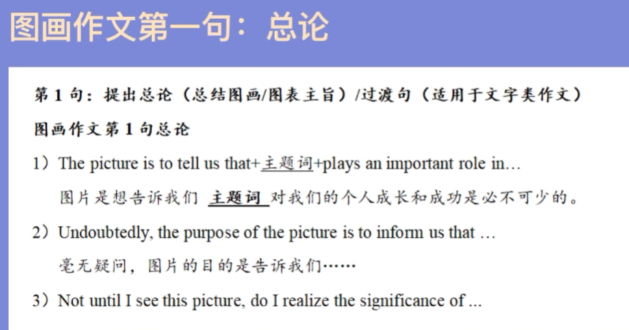

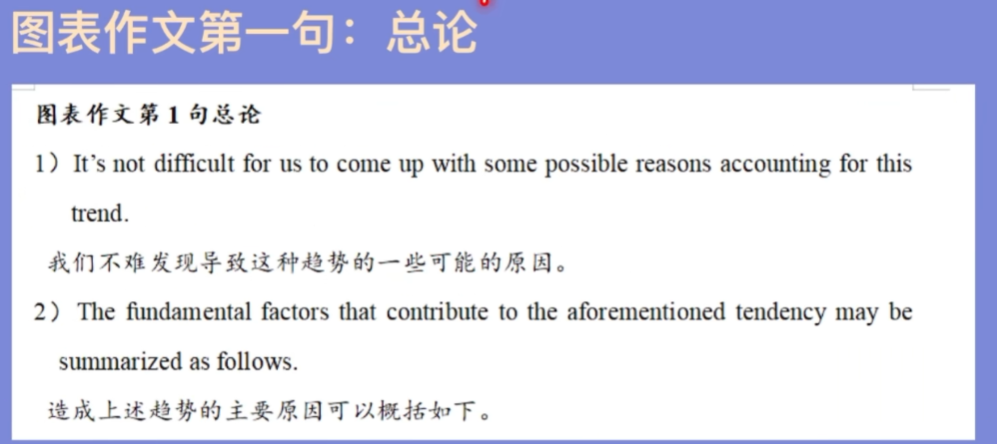

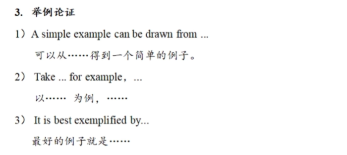

#### 第三段

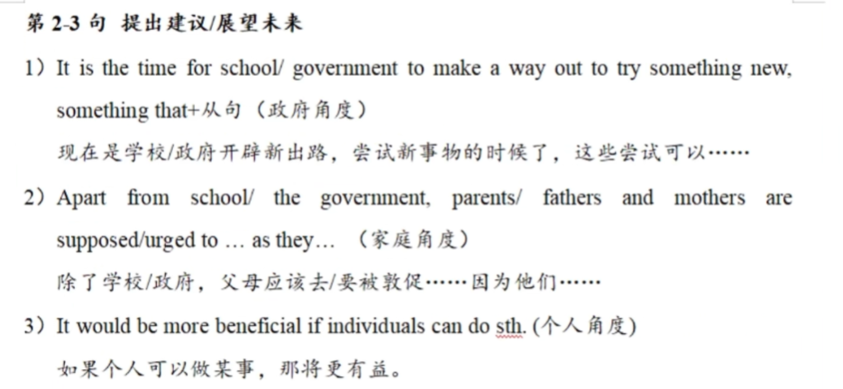

### 书信作文

称呼

文中已给出:

文中未给出：

1. dear sir or madam

2. dear Mr\. president/ professor/ editor

##### 建议类

建议类（建议、推荐、介绍、欢迎、祝贺、通知、道歉）

第一段：首先表明你是谁\+写信目的

I am a 身份介绍。I am very glad to hear that you are seeking for some suggestions about 建议主题。Therefore, I’d like to put forward some opinions as follows\. 

第一段以祝贺开头：

Congratulations on your acceptance by XXX大学/Congratulations on winning the first prize in the competition\. I know how hard\-working you've been during the past days/I'm very proud of you and your achievement\.\(先表示祝贺\+肯定对方努力\) In order to help you promote yourself further in the university/future，I’d like to give you some advice\.

第一段以欢迎开头：

We are delighted to welcome you to XXX\. You are about to begin one of the most exciting times in your life\. In order to give you an unforgettable experience in XXX, here are some conducive suggestions\.

第二段：给出你的建议

In my opinion, first of all, I think that it would be beneficial if we/you could\_建议1\.Besides,建议2 is of vital/ great importance\. Last but not least, we should 建议3\_because提出这个建议的原因\.

第三段：希望建议有用\+期待回复

l would appreciate it if you take my suggestions/ opinions/ proposals/feedbacks/ recommendations into consideration\. Looking forward to hearing from you\.

Yours respectfully/sincerely/faithfully,

Li Ming

##### 邀请类

标准的邀请类

第一段：表明身份/事由\+写信目的

l am a身份介绍\.On behalf of the 某组织/某团体，I am very delighted to inform you that you are sincerely invited to邀请的具体活动\.

以感谢为理由的邀请

第一段：以感谢开头\(表达谢意\+写信目的\)

l am writing this letter to thank you for your warm hospitality/careful arrangements during my visit to 某个地方/my preparation for the competition\. Without your help it would be impossible for me to 根据题干信息发挥\_do that/ have such a good time\. In order to express my gratitude, I cordially invite you to根据题干信息发挥\.

第二段：发起邀请\(较正式\)

活动名称is planning to be held on时间\(12th, October, 2020\) at the地点\.It will last for about\_持续时间, including xxx and xxx活动详情内容\. We hope that you can其他的一些请求which could be very helpful for 补充其他信息。

第二段：发起邀请\(没那么正式\)

I know you are interested in XXX，so if you come to某个地方, I'm sure that you can have an unforgettable holiday/enjoy yourself in the party/ \.\.\.I can take you to具体的景点/地点/活动\_which is a wonderful place/opportunity for us to do sth\.

第三段：期待对方接受邀请\+期待回复

Finally, I would like to express my gratitude to you once again\.\(感谢开头的邀请信可以加这一句\)I/We sincerely hope that you could accept my/our/the invitation\. If you have any concerns regarding this，or there is anything else that I/we can help with, please do not hesitate to contact me/us\.

Yours respectfully/sincerely/faithfully,

Li Ming

##### 投诉类

第一段：前情提要（买了什么东西，接受了什么服务，有什么不好的体验\)

第二段：提出想要得到的处理措施/补偿方式/需要改进的地方

第三段：期待回复\+给出自己的联系方式

Dear XXX,

l bought a\(n\)物品名称in your store on时间\.Unfortunately,物品名称doesn't perform well\./ I'm writing to file a complaint about the service I received in your store on时间\. I think there are something that needs to be improved\.

l would appreciate your understanding if the物品名称can be refunded or exchanged\. According to the warranty，the terms entitle me to a replacement or are fund\. Enclosed are originals of my receipts of this物品名称\.

Please contact me at this email address or by mobile phone at 18100000000\. I'm looking forward to your early reply\.

Yours respectfully/sincerely/faithfully,

Li Ming

##### 申请信

If I were elected, I would spare no efforts to participate in the training and make myself more qualified\. Moreover, I would place more importance on team spirit and cooperate with others\. To sum up, I would make every efforts to finish the mission assigned to me\.

