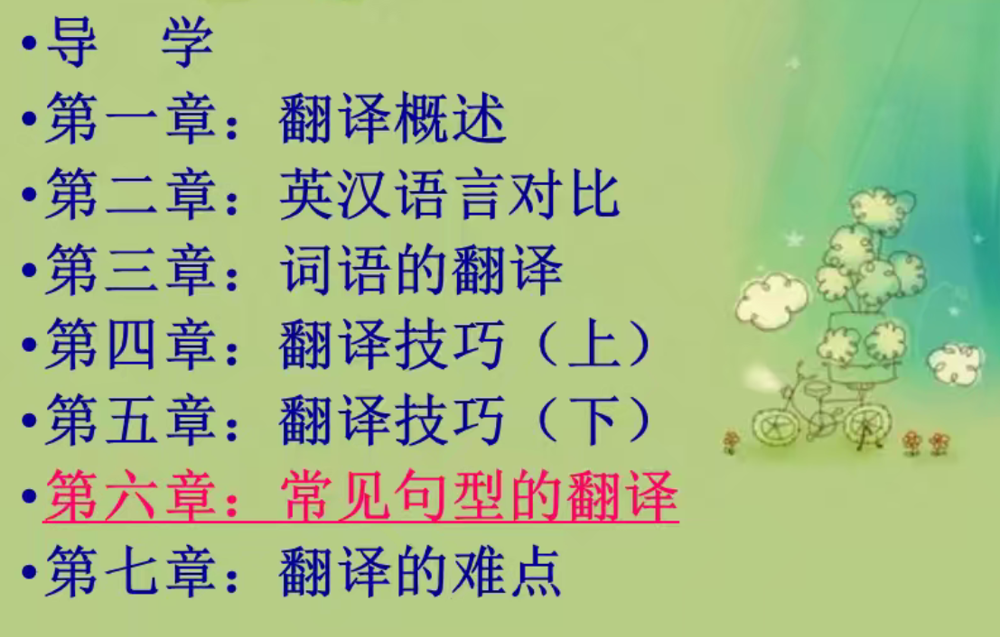
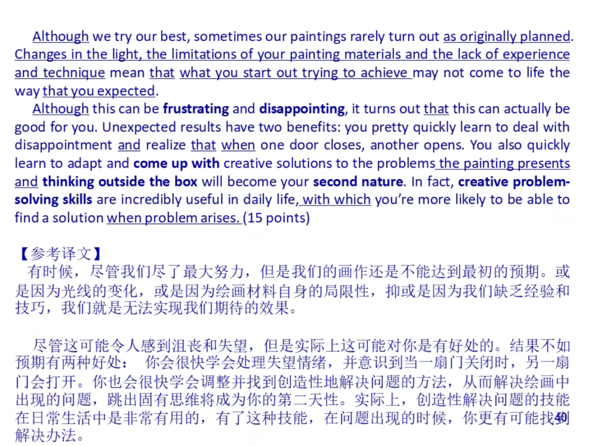
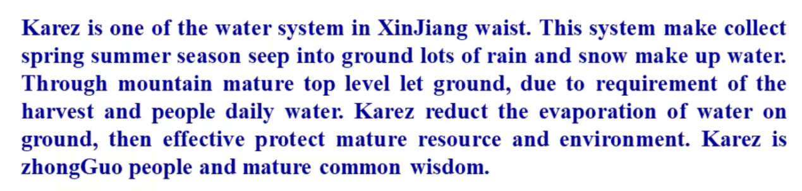
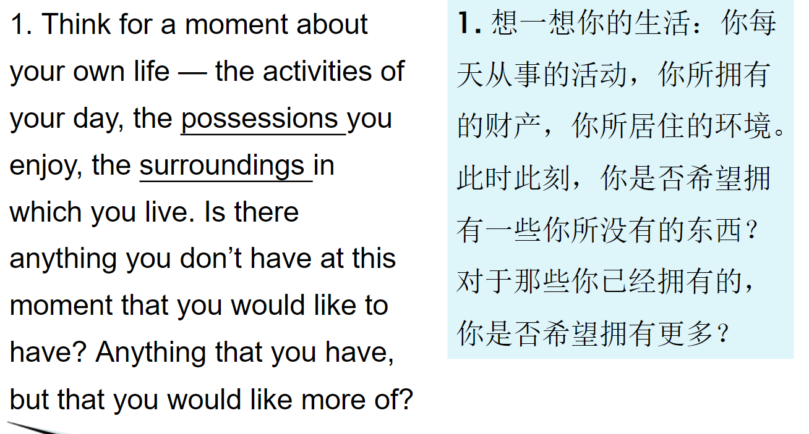
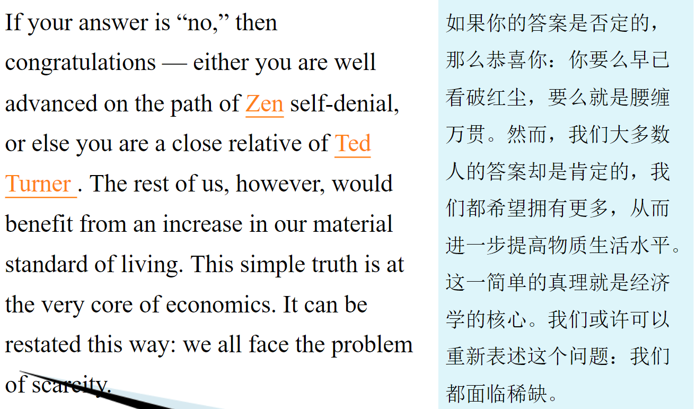
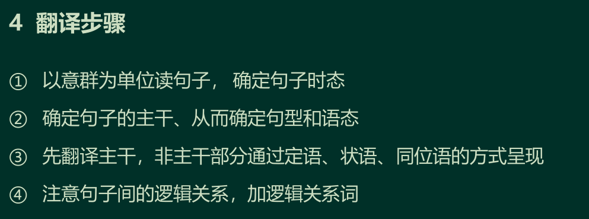
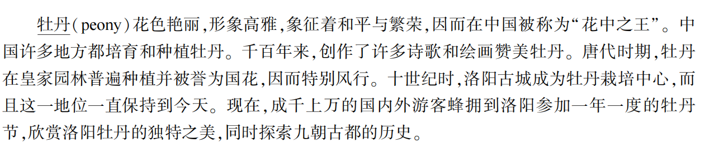
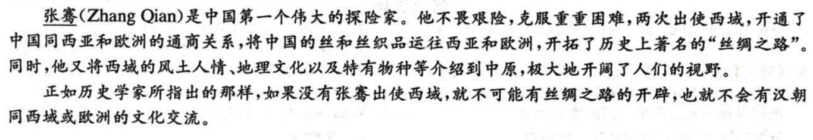
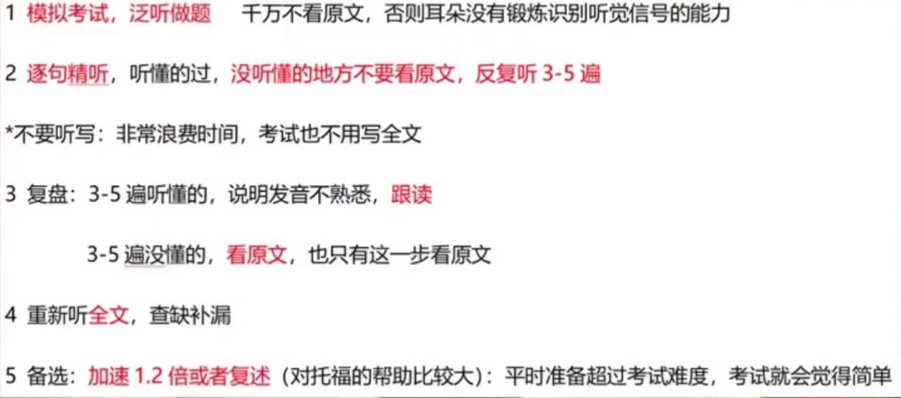

# 翻译、阅读、听力

# 翻译

输入容易输出难

校对两遍

光说不练假把式

Action speaks louder than words\.

如果有翻译 10，段落翻译。

一共三篇翻译：最后交个作业

其中一篇是课上讲的文章

[https://max\.book118\.com/html/2022/0504/7123154150004116\.shtm](https://max.book118.com/html/2022/0504/7123154150004116.shtm)

## 六级翻译

### 2023年下半年六级翻译预测

美丽新农村

最近几年，中国乡村焕发新生，农村居民生活条件显著改善。

revitalize 使恢复生机；给予……新活力；使复苏

In the recent years, villages in China have been revitalized, and the living conditions have been improved significantly\. 

各地政府积极探索中国式农村振兴之路，实施农村产业升级。 

Local governments have actively explored the Chinese Road of Rural Revitalization, and have implied upgrading  rural industries\.

农田基础设施不断完善，农产品质量明显提升。

设施Facilities 基础设施 infrastructure 农业 agriculture 农村rural significantly

Farmland infrastructure have been completed constantly, and  qualities of agricultural products have been improved obviously\.

中国在持续推动农业生态修复和农田水利设施建设的同时，中国大力推进农村旧村改造，着力打造美丽乡村，实现农村环境的整体提升。

……的同时 while doing ……,…… vigorously 大力

While continuously promoting restoration of agricultural ecology and building of farmland water facilities, China has vigorously promoted the renovation of old villages, has emphasized on building beautiful villages and has realized the overall improvement of rural environment\.

政府在全国范围内推进乡村经济的体系建设，积极进行农田资源普查和危房整治，努力为农民创造宜居、宜业、宜游的乡村生活环境。

census 普查

Chinese government has promoted the systematic construction of rural economy nationwide, and has actively conducted census of farmland resources and repair of dangerous house\. It has tried hard to create a rural living environment for farmers to live, work and have fun\.

绿色能源

中国绿色能源发展势头迅猛，成为全球可再生能源的领导者之一。

one of \+n复数

的 的翻译

of:前后名词

in:某个地方

With the rapid development of its green energy, China has become one of leaders in renewable energy world wide \.

风能、太阳能、水能等绿色能源产业蓬勃发展，绿色技术和创新逐步成熟。

Green energy industries, such as wind power, solar power and water power, have developed prosperously \.

Green technology and innovation have become mature gradually\.

中国政府大力支持可再生能源，提出碳中和\(carbon neutrality\)目标，推动能源结构的升级。

Chinese government has strongly supported renewable energy, has proposed the aim of carbon neutrality, and has promoted the upgrade of energy structure\.

绿色能源不仅有助于应对气候变化，还为中国经济提供了新的增长点，促进了能源行业的转型升级。

不仅 还 not only but also

Be helpful for

Green energy has not only contributed to coping with climate change, but also has provided Chinese economy with new growth points\. It has promoted the transformation and upgrade of energy industry\.

传统音乐

中国的传统音乐是世界上最古老、最丰富的音乐之一。

Chinese traditional music is one of the oldest and the richest in the world\.

古琴、古筝、二胡等传统乐器流传千年，各具特色。

传统乐器，比如：古筝、古琴 ，被流传千年

有：have has, there be, with

Traditional musical instruments, such  as Guqin, Guzheng and Erhu, have been passed down for thousands of years, each with its unique characteristics\. 

传统音乐注重对情感和意境的表达，以旋律优美、深沉的特点而闻名。

以……而闻名：be famous for \+原因 be known as\+名气 renowned 有名气 注重：emphasize

Traditional music emphasizes the expression of emotions and feelings\. It is famous for beautiful melody and pensive feature\.

古老的音律传承至今，成为中国文化的重要组成部分。

The ancient melody has been passed down to the present day\. It has become an important component of Chinese culture\.

现代音乐中也融入了传统元素，使中国音乐在保留传统特色的同时焕发新的生机。

Traditional elements have been incorporated into modern music, making Chinese music revitalized and keep traditional feature\.

中国互联网医疗取得重大进展，为居民提供了更便捷的医疗服务。

医疗：healthcare

Chinese Internet healthcare has made huge progress and has provided residents with a more convenient medical service\.

通过手机APP、远程诊疗等方式，人们可以在线咨询医生、购买药品，实现了医疗资源的更加均衡分配。

By apps on cellphone, distant diagnosis and treat, and other ways, People can consult doctors and purchase medicines online\. A more balanced distribution of medical resources has been realized\.

互联网医疗的发展不仅提高了医疗服务的效率，也满足了人们对健康的更加个性化和便捷的需求。

The development of Internet healthcare has not only improved the efficiency of medical service, but also has met the more personalized and more convenient needs of people’ health\.

中国传统医学是一宝贵的文化遗产，包括中医和中药两大主要分支。

Chinese Traditional medicine is a valuable culture heritage\. It includes two main branches: Traditional Chinese medicine and Chinese Herbal medicine\.

中医强调整体观念和平衡，通过针灸\(acupuncture\)、推拿、草药等方式调理身体。

整体的 holistic comprehensive whole 

Traditional Chinese medicine emphasizes holistic concept and balance\. It regulates health body through acupuncture, massage, herbal medicine and other ways\.

中药注重草本植物的应用，形成了千百年的丰富经验。

Chinese Herbal medicine focuses on the application of herbal plants, forming rich experience over thousands of years\. 

传统医学在中国不仅是一门医学科学，更是一种生活方式和文化传统，深受人们的信仰和依赖。

In China, Traditional Chinese medicine is not only a medical science, but also a life style and culture tradition\. It is deeply believed and relied upon by Chinese people\.

给30min，用25min,剩下给选词填空。

### 1\.单词不会写

1. 用该单词的上位词来替换

2. 用该单词的近义词来替换单词

3. 用会的单词把单词解释出来

### 2英汉差异对比

#### ① 汉语意合，英语形合

汉语没有主谓宾，英语必须有主谓，主语是谓语的发出着，宾语一定是谓语的对象。

#### ② 逻辑关系词的使用上

equally likewise    and

nevertheless conversely   but

therefore consequently    so

besides furthermore    then

#### 1 英语多被动 汉语多主动

#### 2 英语多长句 汉语多短句

非谓语动词\+从句\+连词

乌镇是浙江的一座古老水镇，坐落在京杭大运河畔。这是一处迷人的地方，有许多古桥、中式旅店和餐馆。

Wuzhen is an ancient water town in Zhejiang Province, located near the Beijing\-Hangzhou Grand Canal\. It is a charming place with many ancient Bridges, Chinese hotels and restaurants\.

located near 坐落在附近

canal 运河 

大熊猫是熊科中最罕见的成员，主要生活在中国西南部的森林里。

The giant panda is the rarest member of the bear family and lives mainly in the forests of southwest China\.

中国人自古以来就在中秋节庆祝丰收，这与北美庆祝感恩节非常相似。

Since ancient times, Chinese people have celebrated harvest on the Mid\-Autumn Festival, which is very similar to Thanksgiving in North America\.

similar to 相似

在过去的一千年里，乌镇的水系和生活方式没有发生太大的变化，是一座展示古代文明的博物馆。

In the past thousand year, Wuzhen's water system and life style have not undergone many changes, and it is a museum to show ancient civilization\.

Over the past few thousand years 在过去的几千年里

这些资金用于改善教学设施、购买书籍，使16万多所中小学收益。资金还用于购置音乐和绘画器材。现在农村和山区的儿童可以与沿海城市的儿童一样上音乐和绘画课。（2014年四级）

These funds were used to improve teaching facilities and purchase books, benefiting more than 160,000 primary and secondary schools\. The funds were also used to purchase music and painting equipment\. Now children in rural and mountainous areas can have music and painting lessons like those in coastal cities\.

### 例题

With its bright colors and elegant image, the peony symbolizes peace and prosperity, and thus it is known as（被称为） the "king of flowers" in China\. The peony is cultivated and planted in many parts of China\. Over the centuries, many poems and paintings have been created to praise the peony\. During the Tang Dynasty, peonies were cultivated widely in royal gardens and were praised as the national flower, so they enjoyed great popularity\. In the 10th century, the ancient city of Luoyang became the center for peony cultivation, and the position has been maintained till now\. Now, thousands of tourists from home and abroad flock to Luoyang for the annual Peony Festival to enjoy the unique beauty of the city's peonies and explore the history of the ancient capital of nine dynasties\.

symbol n\.象征 symbolize v\.象征

2023\-3\-1 六级

Zhang Qian was China’s first great explorer\. He fearlessly overcame numerous challenges and embarked twice on two expeditions to the Western Regions\. Zhang Qian established trade relations between China, West Asia and Europe and facilitated the transportation of Chinese silk and silk fabrics to these regions, thus opening up the famous “Silk Road" in history\. At the same time, he also introduced the customs, geographic culture and unique species of the Western Regions to the Central Plains, greatly broadening people's horizons\.

As historians pointed out, without Zhang Qian's missions to the Western Regions, the opening of the SilkRoad and cultural exchanges between the Han Dynasty and the Western Regions or Europe would have been impossible\.

西域：the Western Regions 西亚：West Asia 中原：the Central Plains\.

embark : 上船，上飞机；着手，开始（新的或艰难的事情）

expedition: 远征，考察；探险队，考察队；动作敏捷，迅速

facilitate:促进；帮助（的过去分词）；使有利发展

custom: n\.风俗,复数\+s\.

customs:海关，关税

geography：地理，地理学；地形，地貌

geographic:地理的，地理学的。

broaden:增长，变宽 broaden one's horizon 开拓视野

historians：历史学家

2023\-3\-2 六级

梅花（plum blossom）位居中国十大名花之首，源于中国南方，已有三千多年的栽培和种植历史。

The plum blossom, which ranks first among the top famous flowers in China, originated in the South of China and has been cultivated and planted for more than 3000 years\.

定语从句\+并列

中国十大名花：top ten famous flowers in China

十大名花之首：ranks first among the top ten famous flowers in China\.

originate in\+地点，起源于

originate from\+事物，译为来自

隆冬时节，五颜六色的梅花不畏严寒，迎着风雪傲然绽放。

In the dead of winter, colorful plum blossoms brave the bitter cold and blossom proudly against the wind and snow\.

colorful：富有色彩的，五颜六色的

brave v\.勇敢面对

bitter adv\.严寒刺骨地

cold n\.寒冷adj\.寒冷的

blossom n\.花 v\.开花

在中国传统文化中，梅花象征着坚强、纯洁、高雅，激励人们不畏艰难、砥砺前行。

In Chinese traditional culture, the plum blossom symbolizes toughness, purity and elegance, inspiring people to brave hardship and forge ahead\.

tough n\.恶棍v\.坚持;忍受;忍耐adj\.坚韧的adv\.坚强地;坚定地

toughness n\.坚强，韧性

pure adj\.纯洁

purity n\.纯洁

elegant adj\.高雅的

elegance n\.高雅

hardship n\.困难 可数

forge ahead:锐意进取

自古以来，许多诗人和画家从梅花中获取灵感，创作了无数不朽的作品。

Since ancient times, many poets and painters have drawn inspiration from the plum blossom and created countless immortal works\.

since ancient times 自古以来

poet n\.诗人

poem n\.诗

painting n\.画

painter n\.画家

have done 现在完成时，动作已经完成，对现在造成影响。

drawn inspiration 获取灵感

countless 无数 

immortal adj\.不死的，永存的；不朽的，流芳百世的，永垂千古的n\.神，永生不灭者；永垂不朽的人物

work 作品

普通大众也都喜爱梅花，春节期间常用于家庭装饰。

The common people also love plum blossoms, which are often used as home decorations during the Spring Festival\.

decoration n\.装饰;装饰品 可数

南京市已将梅花定为市花，每年举办梅花节，成千上万的人冒着严寒到梅花山踏雪赏梅。

The city of Nanjing has designated the plum blossom as its city flower and holds a plum blossom festival every year, during which thousands of people brave the bitter cold to take a walk in the snow and enjoy the plum blossoms on the Plum Blossom Hill\.

designate: v\.把……定名为，把……描述为；任命，指定；标明，标示adj\.已当选而尚未上任的

# 阅读

先做仔细阅读20min做完，长篇阅读15min，然后翻译。

## 三．传统阅读

1. 时间： 10分钟/篇

2. 指导原则：

1. 读首段及各段首句把握文章中心 2min

2）顺序原则

出题顺序与行文顺序一致

3. 题型分类：

主旨题：无论题干问什么，四个选项中和文章中心靠近的一定是正确答案。

作者态度题不选词：

indifferent   biased   prejudiced

detached   neutral   pessimistic

subjective   puzzled   confused

细节题：用主旨做不出来的就是细节题。关键词定位和顺序定位。

正确答案特征：

位置：定位句\+前后句

细节题的正确答案一定来自文中。

## 四．长篇阅读

15min

1. 看大标题和小标题推测文章中心（中心词不能拿来定位）

2. 找题干中的定位词 回头定位

专有名词：时间、地点、数字、人名、地名、国家名

固定概念：合成词、专业概念、特别说法、具体的名词

动词、极端词、最高级、形容词、副词

1. 重叠选项，得出答案

找出明显定位词后，最好阅读一下该句子意思，和选项是否意思一致

1. 查漏补缺

找不到最后做。读每一段的段首和段尾句。每一段最多两个选项。

## 五．选词填空

7\-8min

1. 标注选项中单词的词性，归类；

2. 看文章的首句，了解文章的中心

3. 根据第个空出现的位置判断需要填的词性

4. 把对应词性的选项带入，符合意思一致即正确答案

# 听力

## 题型

长对话两篇 八道题 8%分值

篇章两篇 七道题 7%分值

讲座/讲话三篇 十道题 20%分值

视听一致

眼睛看到与耳朵听到一致或出现次数越多

关键词原则

划关键词 听音频 扫选项

同转原则

同根词

词词替换:big\-large\-massive

短语替换:pull down\-knock down

宽泛到具体：food\-tomatoes

## 主旨题

选项多为n 动名词 和概括性的词

## 数字题

一般涉及到时间、金钱、数量

1）大部分所听即所选

2）需要推测

## 观点态度题

1）先进行一般性评价，然后再说出个人观点

2）间接说出态度，比如说就这前人的态度，会说the same，me too

## 细节题 

1）所听即所选

2）不明显的，就重点听一些地方。

## 方法和技巧

预读\+所听即所选\+顺序原则

1. 一定要预读

1）to \+v

2）by 方式

3. 备选项 it 开头，可能在问一个事情或事物

4）备选项 they 开头，可能会问一类人或事物

5）he, she, the man, the woman, 在问具体的一个人的活动

2. 寻找中心词，推测文章大概内容

3. 纵横对比，猜题目问题

4. 听力重点

◆ 所听即所选

◆ 开头结尾重点听

◆ 逻辑关系词处：

转折、条件、原因、举例、列举

◆ 特殊句型处

◆ 数字信息处

◆ 比较级，最高级处

# 期末考试

考试题型：听力、词汇或翻译、阅读、完形和写作

听力：上课听力（从后往前听） 四六级

阅读：课文文章3 4 7 8 9 text b 考研

写作：五次作业 150词议论文 多写

翻译：最后一次作业

计划：翻译作业\+作文模板\+听力\+考研阅读\+翻译\+上课相关

# 期末真题

## 作文

According to some individuals, the most effective approach towards decreasing crime rates involves imparting knowledge to parents about effective parenting strategies\. Do you agree with it?

In modern epoch, the issue of reducing crime rates has always been a matter of public interest\. Some individuals champion the notion that the most effective method of reducing crime rates involves imparting parenting skills to parents\. Despite recognizing the merits and drawbacks behind the viewpoint, I am inclined to support it\. 

On one hand, providing children with a good family education can help them develop a positive set of values and  ultimately prevent them committing crimes\. This is mainly because people’s beliefs and ideas are often closely related to their educational background\. Furthermore, a good population quality is a crucial to the development of a country\. For example, according to a study by the University of Hong Kong in 2019,there is a clear negative correlation between  the crime rate in a certain city and the education level of middle\-aged parents there, indicating that the higher the education level，the lower the crime rates\. Therefore，educating parents can be very beneficial in terms of improving the population quality and reducing the crime rate\.

On the other hand, educating parents can also promote the psychological development and self\-restraint of those who are parents themselves, as one of the most significant princes of family education is leading by example\. If parents want to cultivate children well, they have to set a good example themselves\. For example, many criminals have parents with low moral standards, and their families also have a history of varying  degrees of crime\. Therefore, the merits of parenting skills are of obviousness\.

To conclude, imparting knowledge to parents on effective parenting skills can greatly alleviate the crime rate prevalent with the adolescent, young adult and middle\-aged demographic\. I am firmly convinced that this methodical approach is a sensible strategy to combat crime within our society\.

some people think that we should try our best to protect animals\. To what extents do you agree or disagree?

In modern epoch, the issue of protecting animals has always been a matter of public interest\. Some individuals champion the notion that we should spare no effort to protect animals\. Despite recognizing the merits and drawbacks behind the viewpoint, I am inclined to support it\.

For one thing, protecting animals is an effective method to maintain the balance of ecosystem\. Because the quality of ecosystem is positively related to the variety as well as amount of species\. For example, a recent research released by HKU showed the result that increasing number of animals protecting areas played a significant role in environmental protection\. More and more people choose to devote themselves to the field of animal protection\. Therefor, it is necessary to protect animals\.

For another, what matters most in the development of medical technology is the resources of animals species, which requires a high level of animal protection\. Because many of the results in the medical technology need the experiments of animals\. And it is the booming of medical science that ensure the quality of our lives\. To be more specific, when solving the problems or Covid\-19, many scientists tried to find solutions by many animals experiments\. Fortunately, they managed to create the vaccine of the pandemic, which saved millions of human lives\. Thus, protecting animals is protection ourselves\.

In conclusion, I think we should try our best to protect the animals due to the reason that it is also a way to protect the environment as well as our own lives\.

Discuss类

Some people think everyone has the right to use as much fresh water as they want, while others believe government should control the use of water\. Discuss both sides and give your own opinion\.

In modern epoch, the right to utilize water has been a matter of great interest\. Some individuals champion the notion that they should be allowed to use as much water as they wish, but other people believe that the government should exercise control over such a precious and limited resource\.

Despite recognizing the validities of both sides, I am inclined to support the latter\.

On the one hand, conserving water is essential to prevent its depletion, which could leas to the extinction of humanity\. Because freshwater is a vital material for the majority of living creatures on the planet to survive\. For example, species in water\-scarce areas are severely affected by the lack of water\. Furthermore, encouraging water conservation can raise people’s environmental awareness and promote environmental protection\. Since environmental protection is spontaneous behavior\. People would continue to practice environmental protection, when they form the habit of conserving water\.

你不支持的观点为什么合理但有问题

On the other hand, everyone has the right to use water, and people can use necessary water for their health\. However, wasting water is an action of infringing on the right of others to use fresh water, due to the reason the everyone is equal in enjoying the resources on the Earth\. For  example, many people in the Middle East do not have enough drinking water\. The water wasted by people in other areas are enough to greatly improve the lives of people in that area\.

In conclusion, it is the limitation on using fresh water that can actually ensure the human         rights of using water\.

雅思

日期：2020\.05\.20

科目：大作文 Task2

Learning language is the best way to learn about a culture\. To what extent do you agree or disagree？

学习语言是了解一种文化的最好方式。你在多大程度上同意或不同意?

1\.有了ChatGPT能不能不学习?

2\.预防疾病比治疗疾病cost\-efficient，你是否赞同

3\.环境保护

4\.关于科学研究，不同人认为应该由私人公司或政府做出和控制。请问你对此怎么看。5\.为什么当代年轻人不爱出去玩

6\.你认为道路安全重要吗，有些人建议一年考试一次有必要吗

7\.很多年轻人在高中毕业后去旅行或\(忘了另—件事\)一年，谈谈优点和缺点。

8\.家长应该鼓励孩子学习还是参加体育活动9\.学外语的时候四种能力\(听说读写\)一样重要，是否同意这个观点。

10\.政府接送孩子上学还是家长接送，谈谈自己的看法

11\.父母给孩子太多压力，是积极的还是消极的

12\.有的人认为现代社会的人对其他人更加依赖\(dependent\)，有的人则认为现在的人更加独立\(independent\)，谈谈这两个观点，并给出自己的观点

13\.The education of young people is highlyprioritized in many countries\. However,educating adults who cannot write or read iseven more important \.\.\.

14\.ai是好还是坏

15\.一些人认为只需要保护对人类有用的动物，你是否赞同

16\.从个人和社会层面，分析人的寿命越来越长的原因/影响

17\.如果一个国家足够富裕，任何额外的生态财富是否会让市民更幸福?

18\.无人驾驶的宽泛使用，同意还是不同意19\.In many countries, traditional food isbeing replaced by international fast food\.This will have negative effects on bothfamilies and societies\.To what extent doyou agree or disagree?

20\.在一些国家的学校的学生们对于管理金钱并没有一个好的理解，分析原因并提出解决措施。

21\.孩子超重和不健康的问题是政府的责任,你同不同意?

22\.越来越多的人利用网络获取信息，这

种现

象是好还是坏。

23\.ai会带来灾难人类将会无法控制我们要不要停止发展Al

24\.Artificial intelligence is as revolutiona

ry

as mobile phones and the lnternet\.你是否同意

