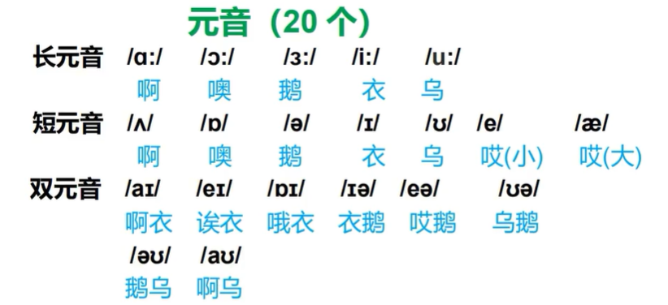
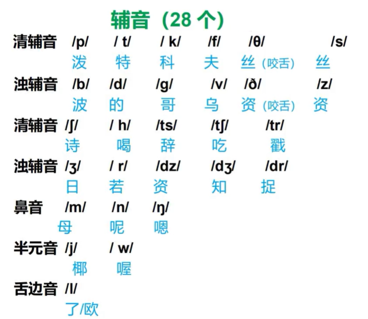
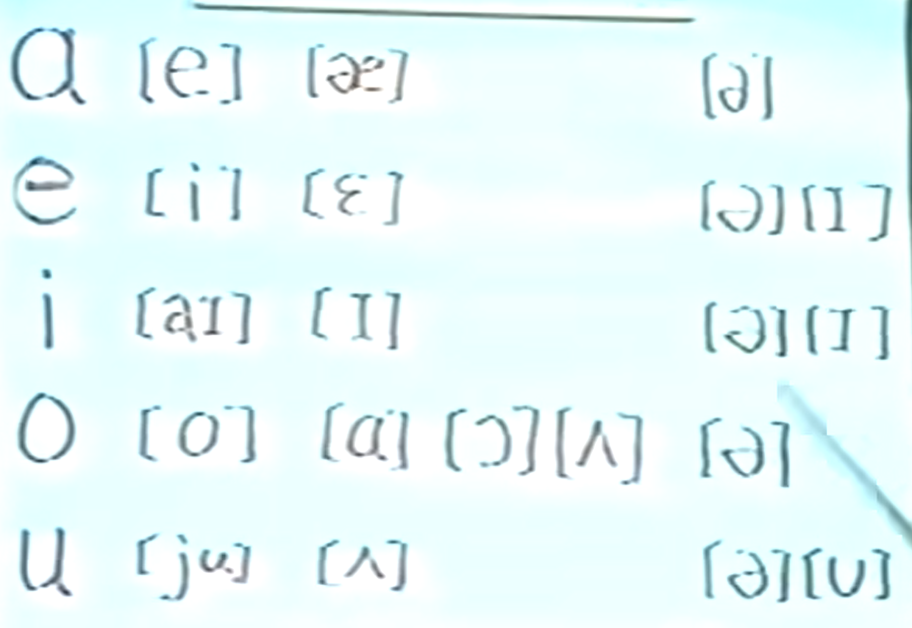
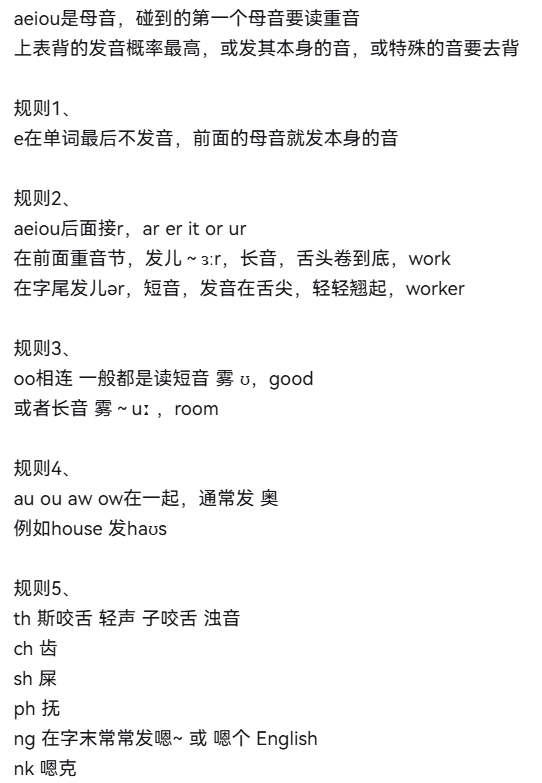

# 英语学习规划

## 重要

1. 音标一定要学好

2. 千万别学语法

3. 背整篇文章，不背对话

4. 只背不行一定要默写

5. 听力\-磨耳朵，习惯英语的语速频率

## 学习路线

音标学习

1. 小学英语

    1. 语法 [https://www\.bilibili\.com/video/BV19r4y1y7Hp/?vd\_source=6b4f479df48e85868d351e47f37cf75f](https://www.bilibili.com/video/BV19r4y1y7Hp/?vd_source=6b4f479df48e85868d351e47f37cf75f)

2. 2W单词

    1. 上一半：[https://www\.bilibili\.com/video/BV1rv411b7Xr/?spm\_id\_from=333\.1387\.favlist\.content\.click\&vd\_source=6b4f479df48e85868d351e47f37cf75f](https://www.bilibili.com/video/BV1rv411b7Xr/?spm_id_from=333.1387.favlist.content.click&vd_source=6b4f479df48e85868d351e47f37cf75f)

    2. 下一半：[https://www\.bilibili\.com/video/BV1su411X7Ug/?spm\_id\_from=333\.1391\.0\.0](https://www.bilibili.com/video/BV1su411X7Ug/?spm_id_from=333.1391.0.0)

3. 本地的资料

4. 抖音收藏

5. B站历史视频 B站收藏

## 音标

元音（20个）

12个单元音（5长7短），8个双元音。

### 开音节与闭音节

开音节

以一个元音字母结尾的重读音节

一个元音字母\+（除r\)辅音字母\+e

闭单节

以辅音字母结尾（除r/w\)

|元音字母|开音节|闭音节|
|---|---|---|
|a|\[eɪ\]|\[æ\] |
|e|\[iː:\]|\[e\]|
|i|\[aɪ\]|\[ɪ\]|
|o|\[əʊ\]|\[ɒ\]|
|u|\[ju:\]|\[ʌ\]|

在开音节中是字母本来的音

### 辅音

#### C

在元音字母e、i前，读\[s\]

在元音字母a，o，u或辅音前面读\[k\]

在ia，ea前面，读\[ʃ\]

#### S

在词首或双写时，读\[s\]

在清辅音后，读\[s\]

在浊辅音或者无音后，读\[z\]

#### G

一般情况下，读\[g\]

在e、i或者词尾\-ge中，读/dʒ/

在n前，有时不发音

#### Wh

在字母O前，读\[h\]

其他情况下，读\[w\]

### 第一课

A /æ/ 哎哎（嘴巴超级扁）

B /b/ 波波

C /k/ 咳咳

D /d/ 的的

E /ɛ/ 哎哎

F /f/ 抚抚

G /g/ 哥哥

H /h/ 喝喝**只有气**

I /ɪ/ 衣衣

J /dʒ/ 句句

K /k/ 咳咳

L /l/ 放在前面 乐乐\[le\]，放在后面 哦哦\[ou\]

M /m/ 放在前面 么么\[me\]，放在后面嗯嗯\[mu\]，抿嘴，鼻子发音

N /n/ 放在前面 呐呐\[ne\]，放在后面嗯嗯\[en\]，开口，舌尖抵住上颚 

O /ɑ/ 啊啊（嘴超大）

P /p/ 坡坡（同坡的拼音）

Q /kw/ 阔阔 

R /r/ 放在前面 若若，放在后面 儿儿

S /s/ 丝丝

T /t/  特特

U /ʌ/ 阿阿（短，口型自然，不用大）

V /v/ 捂捂（上齿轻咬下唇）

W  /w/ 无无（嘟嘴巴）

X /ks/ 科四科四

Y /j/ 耶耶✌🏻️

Z /z/ 日日（咬牙切齿）

### 第二课

子音

除了五个元音都是子音，99%不会有变化。

母音

