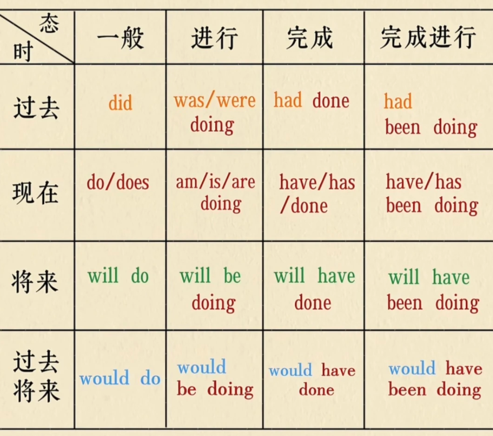

# 语法

## 名动形副代介冠

## 代词pron

> 代词（pronoun）是用来**代替名词或名词短语**的词。
> 
> 例如：
> 
> `Tom is a programmer. Tom likes Java.`
> 
> 可以改成：
> 
> `Tom is a programmer. He likes Java.`
> 
> `He` 代替了 `Tom`，所以 `He` 是代词。
> 
> 

---

一、代词的主要分类

英语代词主要可以分为：

人称代词（Personal Pronouns）

物主代词（Possessive Pronouns）

反身代词（Reflexive Pronouns）

指示代词（Demonstrative Pronouns）

疑问代词（Interrogative Pronouns）

关系代词（Relative Pronouns）

不定代词（Indefinite Pronouns）

相互代词（Reciprocal Pronouns）

此外，还有一些语法体系会单独讨论：

连接代词（Conjunctive Pronouns）

分配代词（Distributive Pronouns）

---

### 人称代词

用来代替前面提到的人或事物

人称代词有人称和数与主宾格的变化

| 人称 | 我  | 你  | 他  | 她  | 它  | 我们 | 你们 | 他/她/它们 |
| ---- | --- | --- | --- | --- | --- | ---- | ---- | ---------- |
| 主格 | I   | you | he  | she | It  | we   | you  | they       |
| 宾格 | me  | you | him | her | it  | us   | you  | them       |

动词后加代词的宾格

### 物主代词

> 表示“某人拥有某物”，即“谁的”。
> 
> 

需要注意：

英语中常把“物主代词”分成两类来学习：

**形容词性物主代词（Possessive Determiners）,必须放在名词前面。**

**名词性物主代词（Possessive Pronouns）,可以独立使用，后面不能直接接名词。**

| 人称     | 我的 | 你的  | 他的 | 她的 | 它的 | 我们的 | 你们的 | 他/她/它们的 |
| -------- | ---- | ----- | ---- | ---- | ---- | ------ | ------ | ------------ |
| 形容词性 | my   | your  | his  | her  | its  | our    | your   | their        |
| 名词性   | mine | yours | his  | hers | its  | ours   | yours  | theirs       |

### 反身代词

| 人称     | 我自己 | 你自己   | 他自己  | 她自己  | 它自己 | 我们自己  | 你们自己   | 他/她/它们自己 |
| -------- | ------ | -------- | ------- | ------- | ------ | --------- | ---------- | -------------- |
| 反身代词 | myself | yourself | himself | herself | itself | ourselves | yourselves | themselves     |

by\+反身代词，通过自己做XXX

### 指示代词

> 用来指示某个人或某个事物。
> 
> 

主要有：

this
这个

these
这些

that
那个

those
那些

例如：

This is my book\.
这是我的书。

These are my books\.
这些是我的书。

That is my car\.
那是我的车。

Those are my cars\.
那些是我的车。

注意：

`this / that / these / those` 既可以作**指示代词**，也可以作**限定词**。

对比：

This is my book\.

`This` 独立使用，是指示代词。

This book is mine\.

`This` 修饰 `book`，属于指示限定词。

---

六、疑问代词（Interrogative Pronouns）

> 用于提出问题。
> 
> 

常见的有：

who
谁

whom
谁（宾格，正式）

whose
谁的

what
什么

which
哪个 / 哪些

例子：

Who are you?
你是谁？

Whom did you see?
你看到了谁？

Whose book is this?
这是谁的书？

What is this?
这是什么？

Which do you prefer?
你更喜欢哪个？

其中：

who → 谁

whom → 谁（宾格）

whose → 谁的

what → 什么

which → 哪一个 / 哪一些

---

七、关系代词（Relative Pronouns）

> 用来引导定语从句，并在从句中代替前面的名词。
> 
> 

常见：

who
whom
whose
which
that

例如：

The man who lives next door is a doctor\.

住在隔壁的那个男人是一名医生。

其中：

who lives next door

是定语从句。

`who` 指代前面的 `the man`。

---

再例如：

The book that I bought yesterday is interesting\.

我昨天买的那本书很有趣。

`that` 指代：

the book

---

### 不定代词

> 指代不确定的人或事物。
> 
> 

常见的有：

some/any，many/much

few/ a few，little/a little

both/all，either/neither

every/no

some多用于疑问句中，any用于肯定句中

| few      | 很少（用于否定句） | 可数名词   |
| -------- | ------------------ | ---------- |
| a few    | 一些（用于肯定句） |            |
| little   | 很少（用于否定句） | 不可数名词 |
| a little | 一些（用于肯定句） |            |

both,两者都，all三者或三者以上


either，两者中任何一个

neither，两者中没有一个


九、相互代词（Reciprocal Pronouns）

> 表示“互相、彼此”。
> 
> 

主要有：

each other
彼此

one another
互相

例如：

They help each other\.
他们互相帮助。

We should respect one another\.
我们应该互相尊重。

在现代英语中，`each other` 和 `one another` 经常可以互换使用。

---

十、分配代词（Distributive Pronouns）

> 表示“每一个、各自”。
> 
> 

常见：

each
每一个

either
两者中的任何一个

neither
两者都不

例如：

Each has a different opinion\.
每个人都有不同的观点。

Either is fine\.
两个中的任何一个都可以。

Neither is correct\.
两个都不对。

注意：

`each / either / neither` 有时可以作代词，有时也可以作限定词，需要根据具体句子判断。

---

十一、代词分类总表

## 冠词article

不定冠词 a/an

定冠词 the

以元音音素开头的单词用an，辅音用a


the用法常考

乐器前面用"the"

用在世界上独一无二的事物前

the\+形容词表示一类人


零冠词

下列情况不用冠

国地人名与语言

季节月份星期前

球类棋类与三餐

还有交通工具前


## 介词prep

介词后加动词ing形式

Looking forward to doing，这里的to是介词


in  → 较大的时间范围 on  → 具体某一天 at  → 具体时间点

​年月周前要用in，日子前面却不行；

遇到几号要用on,上午下午又是in\.

要说某日上下午,用on换in才能行\.

午夜黄黎用at,周末用它也不借\.

at也在时分前,说“差”用to,

in后接，“早午晚，年月季”

on后接具体日子和星期


**in在里面on在上，at用于小地方；若说地点大或小，门牌号码at别忘掉。**

across，从外部穿过；through，从内部穿过

In the tree与on the tree，是否本身就是树的一部分，如果是用on，否则用in

| 分类     | 例词                                          |
| -------- | --------------------------------------------- |
| 时间介词 | at, in, on, before,after, from                |
| 方位介词 | on, in, at, behind, over, above, under, below |
| 方式介词 | by, with, in                                  |
| 动向介词 | to, into, up, down, through, across           |
| 原因介词 | for                                           |

方式介词

by\+交通工具（on foot）

by\+v\-ing，通过做xxx

in\+语言

with\+身体器官


## 连词conj

## 感叹词interj

## 形容词adj

1. 通常放在修饰的名词之前。

2. 放在系动词后面

3. 放在不定代词后面\(something,anything,nothing\)，表示xxx样的东西

形容词用来修饰名词或代词。

**一般情况下，形容词\+ly变副词**

### 比较级

| 构成方法                                        | 原级          | 比较级            | 最高级              |
| ----------------------------------------------- | ------------- | ----------------- | ------------------- |
| 一般情况下，加\-er和\-est                       | tall<br>great | taller<br>greater | tallest<br>greatest |
| 以发音字母\-e结尾的，词尾加\-r和\-st            | late<br>nice  | later<br>nicer    | latest<br>nicest    |
| “辅元辅”结尾的单词，双写最后辅音，加\-er和\-est | big<br>hot    | bigger<br>hotter  | biggest<br>hottest  |
| 辅\+y结尾的单词，变y为i，再加\-er和\-est        | easy<br>happy | easier<br>happier | easiest<br>happiest |
| 两个或两个以上音节单词，前加more和most          | beautiful     | more beautiful    | Most beautiful      |

特殊情况

| 原级         | 比较级             | 最高级               |
| ------------ | ------------------ | -------------------- |
| good<br>well | better             | best                 |
| bad<br>ill   | worse              | worst                |
| many<br>much | more               | most                 |
| old          | older（elder\)     | oldest\(eldest\)     |
| far          | farther\(further\) | farthest\(furthest\) |
| little       | less               | least                |

合二为一有两对，“病坏”“两多”与“两好”

一分为二有两个，一个“远”来一个“老”

还有一个双含义，只记“少”来别记“小”

### 比较级用法

两者进行比较，比较级\+than，比xxx更加xxx

三者或三者以上比较，the\+最高级，意为最xxx

as\+形容词/副词原级别\+as，xxx和xxx一样

## 副词adv

副词用来修饰动词、形容词或其他副词

时间副词：today, yesterday, tomorrow, now

地点副词：here, there, everywhere

程度副词：too, quite

方式副词：slowly, suddenly


1. 修饰动词时，通常放在动词后面

2. 修饰形容词时，通常放在形容词前面

3. 修饰其他副词时，通常放在副词前面


## 名词n

常见不可数名词：液体、时间、肉、纸、友谊、food、health


### 复数

1. 一般加s

2. 以 s、x、sh、ch 结尾，通常加 `-es`。

bus → buses
box → boxes
dish → dishes
watch → watches
class → classes

3. 以辅音字母 \+ y 结尾

把 `y` 变成 `i`，再加 `-es`。

city → cities
country → countries
baby → babies
party → parties

1. 以辅音字母\+o结尾的词，后加\-es，potato，tomato，hero

例外：photos

4. 以 f / fe 结尾

部分名词变成 `ves`。

leaf → leaves
knife → knives
wife → wives
life → lives
wolf → wolves

但不是所有词都这样。

例如：

roof → roofs
chief → chiefs
belief → beliefs

因此这一类需要：

> **规则 \+ 单独记忆**
> 
> 

5. 其他不规则

man → men
woman → women

Policeman\-policemen

Man doctor\-men doctors，前面是man 都要变复数

Boy student\-boy students
child → children
person → people
mouse → mice
foot → feet
tooth → teeth
goose → geese


单复数形式相同

有些名词单数和复数形式一样。

sheep → sheep
fish → fish
deer → deer
species → species
series → series

Chinese\-chinese

People\-people

### 名词所有格


## 动词v

### 实义动词

及物动词\+名词/代词

不及物动词后面不可直接加名词/代词


### 系动词

1. be动词（am is are\)

this that 跟is

these those we 和they，后面跟着are,are,are

2. 感官动词

    1. feel, look, smell, taste sound

3. 变化

    1. Become get turn

### 助动词

为什么要有助动词？

汉语中提问，后面可以加 吗，英语中用助动词

```Java
基本助动词
do
have
be
情态动词（属于助动词）后面必须加动词
will
would
can
could
may
might
should
must
```

为什么助动词后面加动词原型：

助动词已经承担了"时态、人称"这些语法信息，后面的实义动词就保持最基本的形式（原形）。

### 动词三单式

动词单三式

一般情况下，加s

以s,x,ch,sh,o结尾的，加es

辅单字母加y结尾的，变y为i加es

### ing形式

变化规则

1，直接加ing

2，去掉不发音的e，再加ing

3，重读闭音节（辅音 \+ 元音 \+ 辅音），双写最后一个辅音

4，以 ie 结尾，ie → y \+ ing


ask\-asking,study\-studing,dance\-dancing,write\-writing,sit\-sitting,tie\-tying,shop\-shopping,make\-making,read\-reading,buy\-buying

### 过去式与过去分词

| 情况                                 | 变身             | 例子                           |
| ------------------------------------ | ---------------- | ------------------------------ |
| 一般情况                             | 词尾加\-ed       | Look\-looked<br>want\-wanted   |
| 以不发音字母e结尾                    | 词尾加\-d        | live\-lived<br>like\-liked     |
| 以“辅音字母\+y"结尾的词              | 变y为i，加ed     | study\-studied<br>fly\-flied   |
| 末尾只有一个辅单字母的重读闭音节动词 | 双写辅单字母加ed | stop\-stopped<br>plan\-planned |

Plant\-planted

Play\-played

Dance\-danced

Worry\-worried

Ask\-asked

taste\-tasted

### 不规则动词表

原型与过去式一样

| put  |
| ---- |
| cut  |
| read |
| let  |

| 原型   | 过去式 | 过去分词 |
| ------ | ------ | -------- |
| am/is  | was    |          |
| are    | were   |          |
| do     | did    |          |
| have   | had    |          |
| become | became |          |
| come   | came   |          |
| go     | went   |          |
| eat    | ate    | eaten    |
| begin  | began  |          |
| sit    | sat    |          |
| give   | gave   |          |
| get    | got    |          |
| buy    | bought |          |
| teach  | taught |          |
| say    | said   |          |
| see    | saw    |          |
| make   | made   |          |
| feel   | felt   |          |
| sleep  | slept  |          |
| keep   | kept   |          |
| spend  | spent  |          |
| run    | ran    |          |
| sing   | sang   |          |
|        |        |          |


## 句子种类

**陈述句、疑问句、祈使句、感叹句 → 是并列的「句子功能」分类。**

**肯定句、否定句 → 是另一个维度，表示「肯定还是否定」。**

### 陈述句

陈述句分为两种，肯定与否定。

主语\+系动词\+表语

系动词：be动词/感官动词/变化（become,get,turn\)

表语：名词/形容词

主语\+谓语动词\+其他成分


将陈述句中肯定句变否定，**在谓语动词后面加not，如果是实义动词需要助动词来帮助。**

will not = won't

### 疑问句

#### 一般疑问句

只能用 Yes / No 回答


肯定句变一般疑问句

谓语动词为be动词或情态动词时，提到句首，其他照抄。

谓语动词为实义动词时，需要使用助动词do\.do/does/did\+主语\+动词原形


否定句变一般疑问句

一般疑问句的否定结构一般表示怀疑、失望、责怪

#### 反意疑问句

在陈述句后，加上一个简短的问句，提出相反的疑问。

Beijing is a beautiful city, isn’t it? 北京是个美丽的城市，不是吗？

She didn’t buy anything last night, did she? 昨晚她什么也没有买，是吧？

\-He will not marry her, will he? 他不会娶她的，是吧？


let's引导的句子，反意疑问句用shall we

wish，与may 搭配


#### 特殊疑问句

wh家族

| 指代         | 特殊疑问词   | 意思     |
| ------------ | ------------ | -------- |
| “人”相关<br> | who（主/宾） | 谁       |
|              | whom（宾）   | 谁       |
|              | whose（定）  | 谁的     |
| 指代“物”     | What         | 什么     |
| 指代“地点”   | Where        | 哪里     |
| 指代“哪一个” | Which        | 哪一个   |
| 指代“时间”   | When         | 什么时候 |
| 指代“原因”   | Why          | 为什么   |

How家族

| 指代                 | 特殊疑问词 |
| -------------------- | ---------- |
| 指代“方式/健康状况？ | How        |
| 指代数量             | How many   |
|                      | How much   |
| 时间长短             | How long   |
| 频率                 | How often  |

先变成一般疑问句，找合适的特殊疑问词替换划线部分并放到句首

I like english \. Do you like English? Do you like what? What do you like

#### 选择疑问句

提供两者或两者以上的情况


一般疑问句\+or\+可选择部分

一般疑问句\+or\+not

特殊疑问句\+可选择部分\+or\+可选择部分

### 祈使句

### 感叹句

How\+形容词/副词\+主语\+谓语

What\+a/an\+形容词\+可数名词单数\+（主语\+谓语）

What\+形容词\+可数名词复数/不可数名词\+（主语\+谓语）


感叹句，并不难，what与how应在前。

形容词，副词跟着how，what后面名词连。

名词若是可数单，前带冠词a/an。

主语谓语放后面，省略它们也常见。


中心词是名词用what，形容词或副词用how


### There be

There be 表示在某地有某物，hava表示某人有某物

有肯定式与否定式

不可数名数，用单数，is

**否定式**

**There be\+not any/no**

**一般疑问句：将be动词提前**

**特殊疑问句：特殊疑问词\+一般疑问句**

**与情态动词连用，There\+情态动词\+be（原形）**

就近原则

be可以被替换remain,exists\.


## 基本句型

### 主系表

系表示联系，不表示动作

#### 表语（Predicative）

表语：

> 用来说明主语是什么或怎么样。
> 
> 

常见形式：

（1）形容词

例如：

> She is **happy**\.
> 
> 

happy：

描述 She 的状态。

---

（2）名词

例如：

> She is **a doctor**\.
> 
> 

a doctor：

说明 She 的身份。

---

（3）介词短语

例如：

> The book is **on the table**\.
> 
> 

on the table：

说明 book 的位置。

## 特殊句型

### It作形式主语

### 倒装句

## 时态



| 时\\态   | 一般              | 进行            | 完成            | 完成进行              |
| -------- | ----------------- | --------------- | --------------- | --------------------- |
| 过去     | was/were/did      | was/were doing  | had done        | had been doing        |
| 现在     | am/is/are/do/does | am/is/are doing | have/has done   | have/has been doing   |
| 将来     | will do           | will be doing   | will have done  | will have been doing  |
| 过去将来 | would do          | would be doing  | would have done | would have been doing |

时：时间。态：动作的状态

过去：一定有过去式

现在：

将来：will

过去将来：would


一般（经常做、每天做）：do

进行（现在正在做）：be doing

完成（动作做完）：have done

完成进行（为了完成一直在做）：have been doing


### 一般过去时

常见标识：yesterday,last,ago,in\+过去年份，when\+过去事件

### 过去进行时

They were playing football when it started to rain\.

### 过去完成时

过去的过去

### 过去完成进行

### 一般现在时

1. 表示事物的特征，天是蓝的

2. 表示经常性的行为（always, often, usually, every day\)

3. 表示客观事实和普通真理


be动词的一般现在时，am, is, are

实义动词的一般现在时，动词原形或动词单三式

### 现在进行时

be\+v\-ing（现在分词）

时间信号

Now

Right now

At the moment

At present

其他信号：Look\!  Listen\!

### 现在完成时

过去发生，但和现在有联系。already，just,yet,ever,never,for,since

### 现在完成进行时

一直持续

### 一般将来时

时间信号

next\+时间

Tomorrow

in\+时间  xxx时间后

明确未来的时间

**构成：**

1. **shall/will\+动词原形，shall多用于第一人称**

2. **be going to\+动词原形，表示将来打算计划决定要做某事**


## 其他


