# 棋

# 中国象棋

## 学习顺序

1. 基本杀法

    1. 林延秋基本杀法（finish）

    2. [《象棋基本杀法》系列合集高手必备](https://www.douyin.com/video/7305973896925252876)

    3. 老软件

2. 残棋定式

    1. 11个常见的定式

    2. 秋秋讲棋实用残局基础十讲（第七期ing）[https://space\.bilibili\.com/243531340/lists/72360?type=season](https://space.bilibili.com/243531340/lists/72360?type=season)

    3. 秋秋讲棋，精妙残局[https://space\.bilibili\.com/243531340/lists/863639?type=season](https://space.bilibili.com/243531340/lists/863639?type=season)

    4. 有趣的残棋定式[https://space\.bilibili\.com/3493124475193909/lists/1091896?type=season](https://space.bilibili.com/3493124475193909/lists/1091896?type=season)

    5. 象棋冲锋号实用残局

    6. [https://space\.bilibili\.com/471518895/lists/2021906?type=season](https://space.bilibili.com/471518895/lists/2021906?type=season)

    7. 老软件

3. 开局

    1. [https://www\.bilibili\.com/video/BV12441127Xq/?spm\_id\_from=333\.1391\.0\.0\&vd\_source=6b4f479df48e85868d351e47f37cf75f](https://www.bilibili.com/video/BV12441127Xq/?spm_id_from=333.1391.0.0&vd_source=6b4f479df48e85868d351e47f37cf75f)

    2. [https://space\.bilibili\.com/471518895/lists/848634?type=series](https://space.bilibili.com/471518895/lists/848634?type=series)

    3. [https://space\.bilibili\.com/471518895/lists/89332?type=season](https://space.bilibili.com/471518895/lists/89332?type=season)

    4. [https://www\.bilibili\.com/video/BV1nq4y1X7tM/?spm\_id\_from=333\.337\.search\-card\.all\.click\&vd\_source=6b4f479df48e85868d351e47f37cf75f](https://www.bilibili.com/video/BV1nq4y1X7tM/?spm_id_from=333.337.search-card.all.click&vd_source=6b4f479df48e85868d351e47f37cf75f)

4. 古谱

    1. [橘中秘](https://www.bilibili.com/video/BV1P7411u7DJ/?spm_id_from=333.1391.0.0&vd_source=6b4f479df48e85868d351e47f37cf75f)

5. 对弈

6. 象棋教员

    1. 秋秋

    2. 象棋冲锋号

    3. 象棋王小

    4. 鸿鹄飞翔

    5. 板牙

    6. [夜不离棋](https://space.bilibili.com/492225369?spm_id_from=333.788.upinfo.head.click)

7. [骗着与对策](https://www.bilibili.com/video/BV1Cr4y1E7Qj/?spm_id_from=333.337.search-card.all.click&vd_source=6b4f479df48e85868d351e47f37cf75f)

## 基本杀法

### 白脸将

### 双车错

### 重炮杀

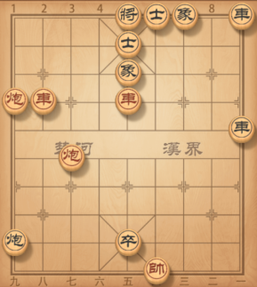

车八进四，士5退4\.炮七进六，士4进5\.炮七退二，士5退4\.车五进一，象7进5\.炮九平五，象5退3\.炮七平五绝杀。

### 闷宫炮

### 困毙

### 卧槽马

### 挂角马

### 钓鱼马

### 高钓马

### 八角马

### 拔簧马

### 铁门栓

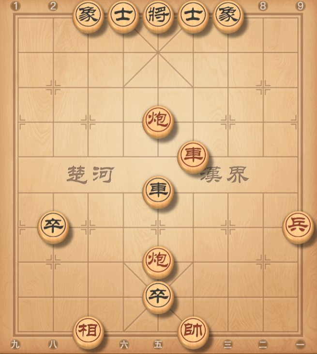

前炮进二

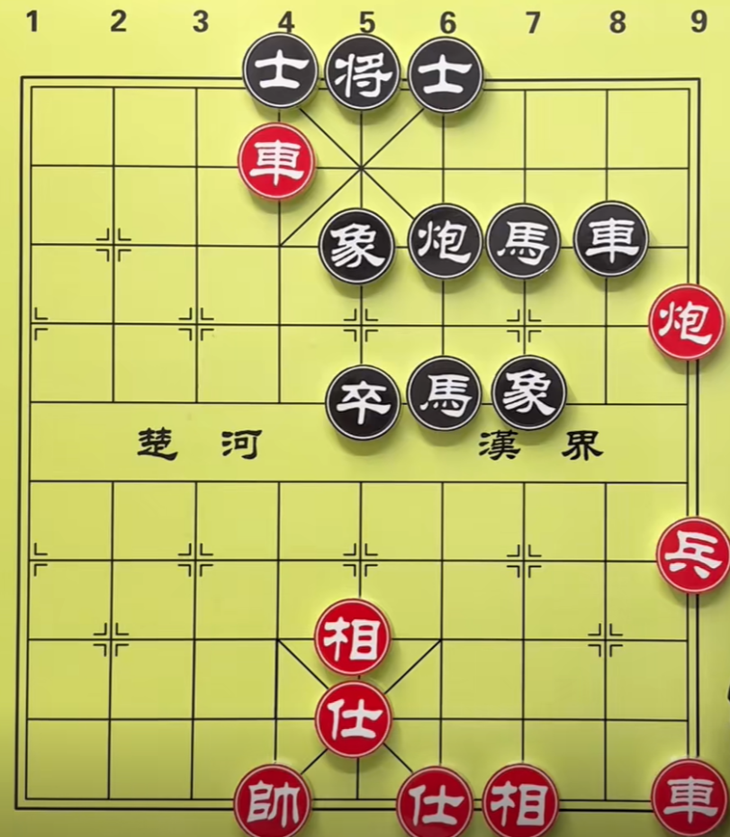

炮一平七，士4进5。炮七平五，

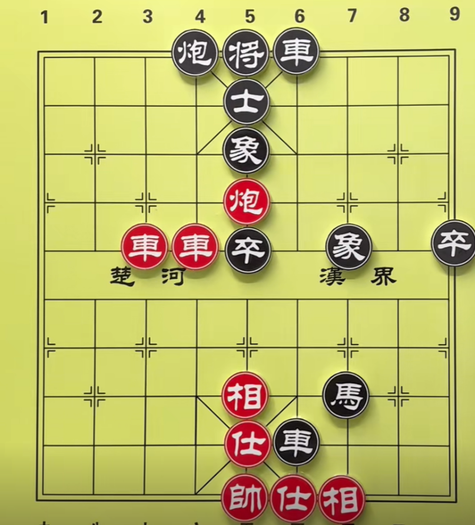

车六进四，将5平4。车七平六，将4平5。帅五平六，前车进1。帅六进一（不要仕五退四）

### 夹车炮

### 平顶冠

### 大刀剜心

### 炮碾丹砂

### 天地炮

### 空头炮

### 车炮抽杀

### 进洞出洞

### 海底捞月

### 老卒搜山

### 三进兵

### 二鬼拍门

### 小鬼坐龙庭

### 双马饮泉

### 马后炮

### 立马车

### 闷将

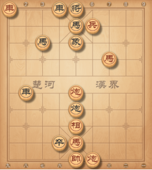

兵四进一，将5平6\.车九平六，马3退4\.马三进二，将6进1\.炮五平四，炮5平6\.前炮平六，炮6平6\.炮六进四绝杀。

### 臣压君

### 双将杀

### 三子归边

### 车马冷着

### 杀法组合

## 残棋定式

### 常见的残棋定式

基础必学马擒单士、炮士对双士、单车对士象全、单马对单象

进阶技巧马兵对单缺士 \\ 象、炮兵对双士 \\ 象

高手必备三兵对士象全、马炮对士象全

冷门但致命车炮海底捞月、双炮单士对士象全单兵对单士 \\ 象

### 单兵类

单兵，只要不是老兵都能赢

#### 单兵对单仕

一般不能赢

#### 兵相巧胜单士

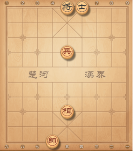

左兵右帅

兵与帅各控制一肋，最后帅平中。

兵从黑没有士的一侧冲下去

#### 双兵对双士

必胜。一个兵先冲下去

#### 双兵对双象

必胜。一兵控制

双兵类残棋，一个兵先冲下去到位再去冲另一个。另一个的方向一定要与第一个相反。

#### 二鬼拍门

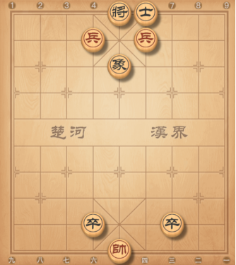

帅五平四，卒7平6。帅四进一，

#### 三仙炼丹

三高兵必胜士象全

兵要卡住没有老将一侧的象眼，第三个兵与帅一起保着第二个兵冲下去。

兵不能轻易下，帅助攻

帅先占中，再把第三个兵冲下去，兵换士成二鬼拍门，根据对方士的位置调整帅的位置，方便借帅

### 单马类

#### 单马对单士

帅占中，转成三种定式

七步成诗

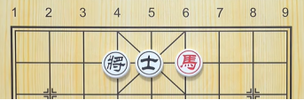

4534687

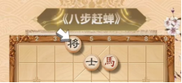

45708687

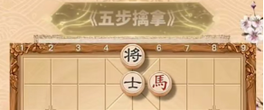

0203

如果将平4，变上式。如果将平6，是203。

#### 单马对双士

巧胜

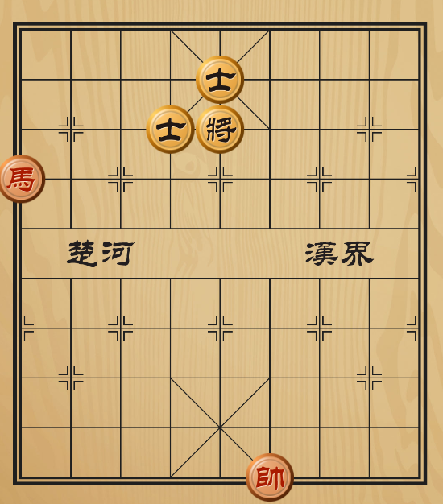

#### 单马对单象

双禁，老将和象都不能动。

将象异侧，一般是和。

将象同侧，非常有可能胜。

黑方口诀：将象异侧，象不飞边，将不上三楼。做到这三点是和。

有四个点非常重要。

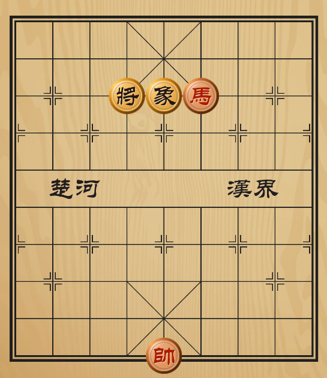

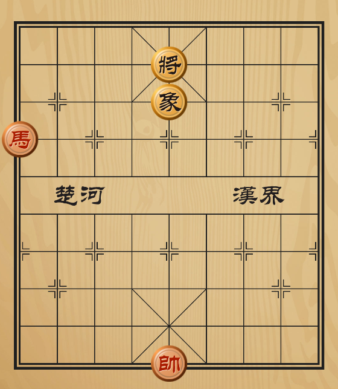

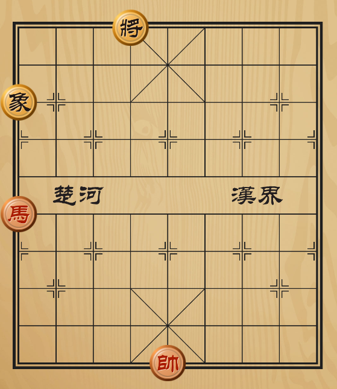

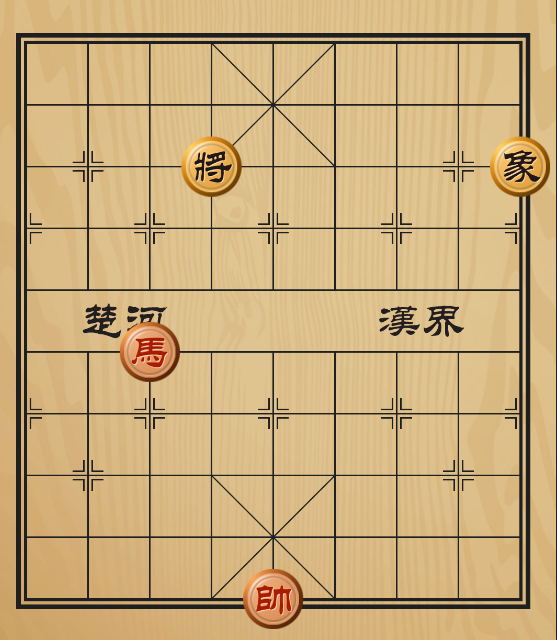

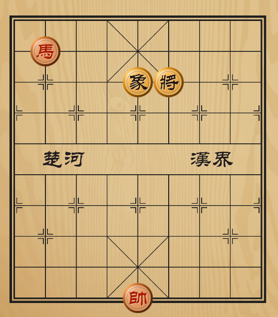

#### 马对单士相

一马和单士相，位置不佳，可胜。

#### 单马对单卒

卒过河一般不能胜。

帅与卒方向相反，把将控制在离卒更近。

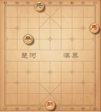

#### 其他

双马单士相胜，双高兵双士，用双马饮泉慢慢吃。

双马胜马双士，先设法吃士。

双马单相胜，炮双士。易胜

单马和炮士象全，守和：用马跟住黑炮，才能守和。

马高兵难胜，士象全，底士防御红兵占中，高士遮帅。

马双兵和炮士相全。

双马胜士想全，用双马饮泉，逐个击破

### 炮类

炮士胜双士，将占中

炮高兵对相，炮塞象脚，左兵右帅。

炮兵胜兵士，兵在七横线，不可进，破士才可进！！。

双炮胜双士，易胜

双炮双相，胜士相全，出将立道，先破士。

炮高兵有相，胜双相

炮双士和双兵。

炮双士和士兵。

单炮和炮双士。

炮单士相和高兵，用兵控制相可和。

炮低兵和士相全。

炮士相和士相全。

炮双士胜相双士，先设法吃，在吃兵。

炮高兵胜双相，左兵右帅。

炮高兵相胜单炮，设法换炮胜。

炮士高兵胜马单士，设法白吃士。

炮兵士双相，胜单缺士，借助帅力，白吃士，抓相露帅。

炮单士和高兵，防：针对攻击方，单士的弱点。

炮士象和双相。

炮双士和兵士，黑将士注意保护，用兵走闲。

炮高兵单象胜双象，帅兵两肋控制，炮象中路抽攻。

炮高兵和单士象，守和士象要密切注视帅兵运用。

炮高兵巧胜单士象，士在高路，用炮控制中路，兵困象。

炮低兵和单士象，守和，士中随机应变，象不飞中，落低。

炮高兵和单缺象，以炮困象，以兵制士，以帅助攻，逼黑落羊角士，帅镇中，兵缩将门，炮沉低。可巧胜

#### 炮单仕例胜双士

黑最顽强的是羊角士

两种方法：

将炮与仕移动到没有士的一侧

#### 炮双仕对单卒单象

必胜。

预备知识，炮单仕必胜单象。

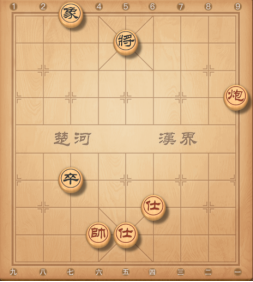

#### 炮兵巧胜士象全

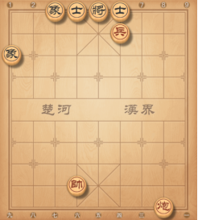

炮二进三，象1进3\.炮二平五，象3退1\.帅六平五，象1进3帅五平四，象3退1\.炮五平一，士6进5\.帅四平五，象1进3\.炮一平八，象3进1\.炮八平七，象3退5\.炮七平五，

帅拉住士是重点。

#### 双炮双象胜双象

把将逼到象的一侧，塞自己象眼。

先破象。帅前炮后，炮打象同时将不能平中。最后要把两个象吃完。

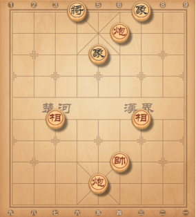

#### 双炮双象胜士象全

剩两个大子，双马，马炮，双炮。前两个对士象全是不需要自己有仕相的，双炮是需要有一个士或两个相。

对于有双相，先将对方两个士消灭，转成双炮双相对双象。

#### 双炮单士胜士象全

### 车类

车胜单缺士，先吃士，在吃相，各个击破。

车胜单缺相，先吃相，在吃士。

车胜单马士兵，充分的利用将困马。

车胜单马士象，先设法吃士，再吃象，再吃马。。

车胜单炮士象，同上。

车和士象全，如位置不正可巧胜。

单车胜马双士，关键把马逼到，无士一边，用抓马吃士。

单车和马双象，马当象占中，一相河头，一象河边。

单车和炮双象，如果中象与河头象相连，炮占中难和。取胜方法，把将赶到2 路，车占中骑河抓相。

一车和双马，守和，双马在中线连环。

一车和双炮，守和，一炮在帅后，一炮走闲。

一车破一排三兵，将占中，车借将吃兵，赶兵到2 或 8 路。

车胜双士。比较容易胜。

车兵和炮士象全，守和，士象正，炮在低线与双象分开。

##### 单车对士象全

单车对双士

单车对双象

单车对单缺象

单车对单缺士

只有三种形状可以和棋。

花士象、正士象、花士象但是一个象在边路。

形状一将士正位，单象飞边

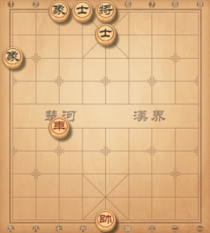

形状二，象飞河界，将是侧位。

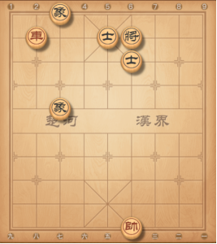

形状三

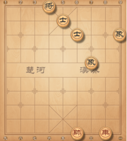

##### 捉山后马

山前马必败，高马必败

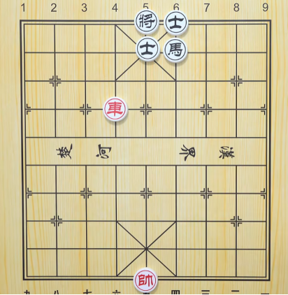

##### 单车兵对车双士

一般不能胜。

### 马兵类

##### 马兵对马卒，和

##### 马兵对炮卒，胜

##### 马兵对马士，胜

##### 马兵对炮士，胜

##### 马兵对马象，和

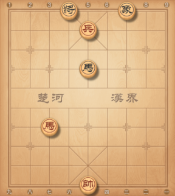

黑马看住兵

##### 马兵对炮象，胜

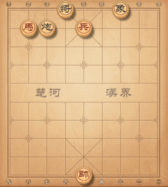

帅五平四（提前占一条肋也是等着），象7进9（只能走这一步，如果进5，马八退七）。马八退七，炮3进1\.马七退六，象9退7\.马六进五，炮3退2\.兵五平六，将4平5\.马五进七，炮3进1\.兵六平七。

##### 马高兵对单缺象，胜，先吃象。

兵在中路，马在炮位。吃象。

##### 马高兵对单缺士，左兵右帅，马到卧槽。

不用吃象，兵到象眼（将的一侧）。用卧槽马，配合帅。

##### 其他

马低兵和单炮，将高位，炮与中路，遮帅档马。

马低兵和单缺士，士在将底，兵无法占中，士在其他位置，可胜。

马高兵胜马士，先设法吃士，再兵占中将。

马高兵胜炮士，设法同上。

马高兵胜炮单相，注意不要用，马或兵换炮，否则和。

马高兵胜单缺士，运用左兵右帅，或一兵换双相。

马高兵胜单缺相，先困相，运兵吃相。形成马兵必胜双士的局面。

马兵胜单马，兵不在低线，利用帅助攻可胜。

马兵胜双相，只要兵不是低兵，一定胜。

马兵和士象全，注意马在3 线，和七线偷袭。

马低兵必胜单象士，有难度需要认真对待。

马底兵和单炮，炮在中，避开红马抽将吃炮，可和。

马底兵胜马，因为马不能像炮一样走直，容易胜。

马高兵胜炮单仕，马在八横三，或七可胜。

马底兵胜炮单象，逼象归边，马中路困将。

马兵和炮双相，炮憋马脚，利用双象走闲。

马双兵和单马士象全。

马双兵和单炮士象全，用炮换兵，成马兵难胜士象全。

### 炮兵类

炮高兵胜双士，帅占中，炮兵联攻。

炮低兵和双士，以将制兵，使帅兵无法同一侧，兵帅占4 或 6 路，可胜。

炮高兵胜单象，高兵与黑相同侧前进，左兵右帅，双塞象。

炮低兵和单象，守和，兵塞象眼，飞边象，将走闲，兵中退象。

炮低兵巧胜单象，针对将高位，逼象飞边线，炮飞另一侧。

炮高兵和双象，守和，象飞兵同侧，炮打象不吃！。

炮高兵单缺士必胜士象全。

取胜方法如下：。

1：兵不可轻易前进，等待白吃士象。

2：用兵换双象，成炮胜双士的局面。

3：利用主帅困将士，再联合攻士，破士取胜。

4：帅控将门，炮镇口头，兵从另侧挺进。威胁士象逼将出宫到 2 路，用炮联和破士。

5：士调到与将同线的士角，摆好中象！主帅调到与士同线的低宫。等中士离开，用兵换双象。

6：士替兵牵住黑羊角士，再运兵到羊角士旁的平线，牵士，炮镇中，逼将出宫，用红帅连接对方将士。破双士胜。

### 车兵类

车低兵胜单车，黑将赶走中路，然后换车。

车低兵和单车，守和：黑占中线，不离开可和。

车高兵和单士象：守和：以车蔗头保士，以仕蔗头保宫心。

车低兵单士和车单士，守和：单车保士，称单车保肋，即车在士角护将，士在另一羊角，且红兵在一侧，使兵不能占中。

2：太公坐骑：士在将底，车沿将门走闲着。

3：攻：黑士在将顶，与黑车换车，用帅困将士，兵占中。

车高兵胜马士象全：

1：设法以兵换双象。成单车胜马双士的局面。

2：在马不合位的情况下，以兵换双士，成单车巧胜马双象的局面。

3：以兵换一士一象，成单车胜马单士象的局面。

注意不能让黑马换红兵成和。

车低兵胜马士象全，抓住黑象不能高飞的弱点，弃兵换士。车运用听着胜。

车低兵和炮士象全。

### 炮双兵类

结论：

三和：1：马双兵和马士象全（含炮）

2：炮双兵和炮士象全（含马）

3：车双兵和车士象全。

三不和：

1：车马双兵胜车马士象全（含炮）。

2：车炮双兵胜车炮士象全（含马）。

3：马炮双兵胜马炮士象全。

马双兵和马士象全，守和：中兵位置是马最佳防守位置。

#### 马炮类

马炮胜士象全：不要用马或炮换士。要个个击破。

马炮士象全胜马士象全：避免换子，设法吃士象。

马炮士象全和炮士象全，人们常说炮和马不和，即是指马炮士象全胜马士象全，和炮士象全，守和：炮在将前，蔗护拦换。

#### 车双兵类

#### 其他

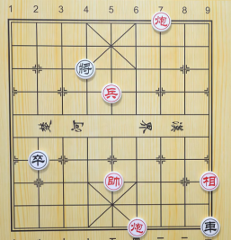

兵五平六，将4退1，相一退三，车9平7，炮三退八，车7进1，炮四平六，车7平4，

##### 送佛归殿

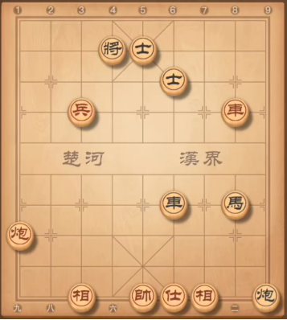

##### 单车保肋士

和棋

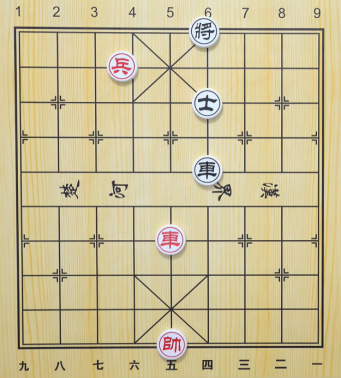

##### 马单兵对士象全

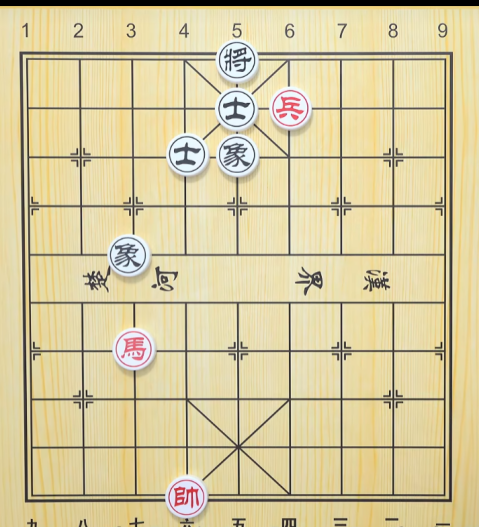

##### 将军脱袍

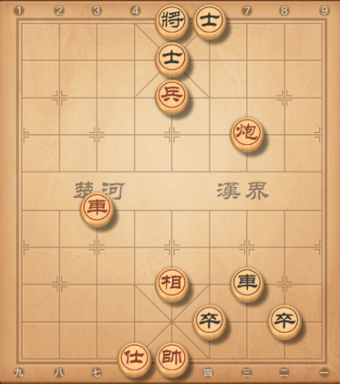

##### 其他

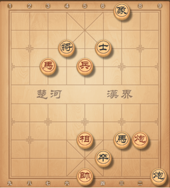

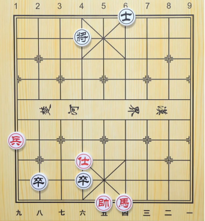

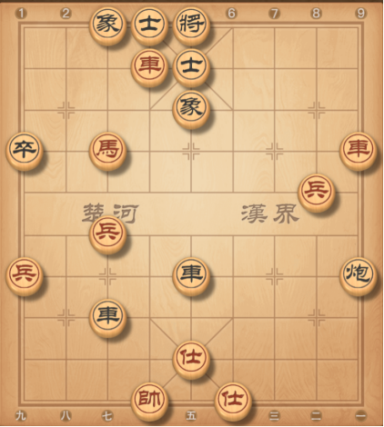

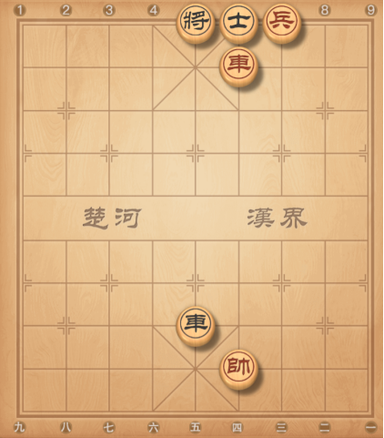

## 开局

### 炮类开局

#### 中炮类

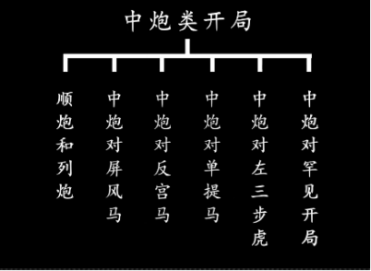

##### 顺炮

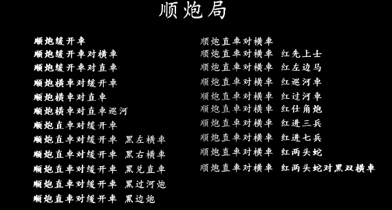

###### 顺炮直车对横车

红正马进三兵型

红两头蛇黑双横车型

红其他变例

##### 列炮

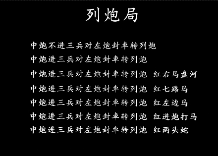

##### 中炮对屏风马

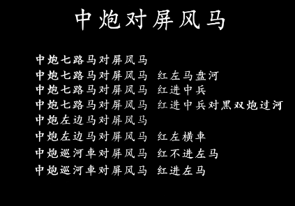

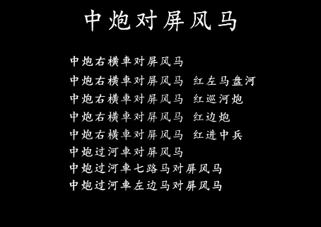

##### 中炮对反宫马

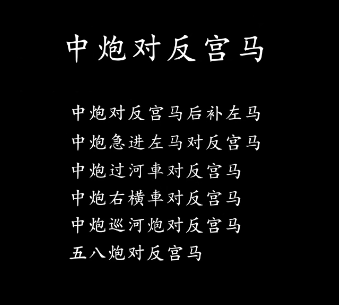

##### 中炮对单提马

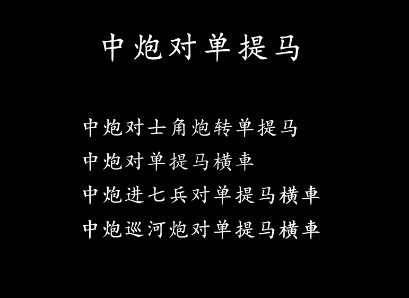

##### 中炮对左三步虎

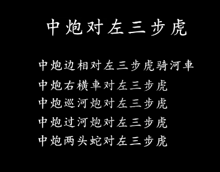

##### 中炮对罕见开局

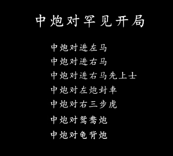

#### 过宫炮类

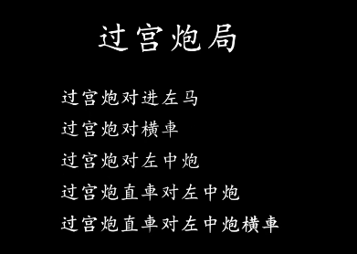

#### 仕角炮类

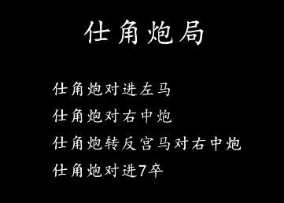

### 马类开局

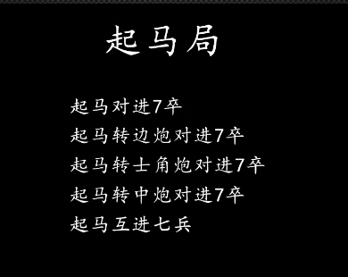

### 飞相局

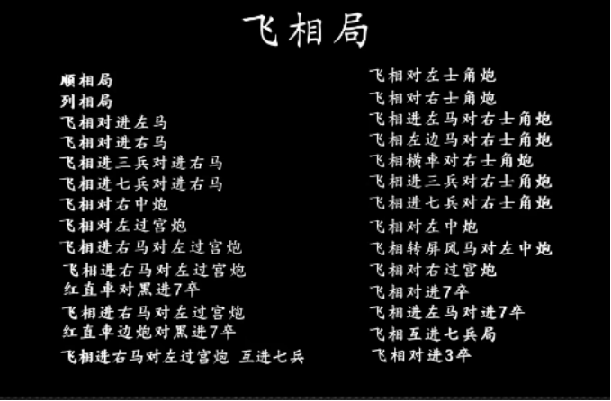

1. 炮类

1\.1\. 飞相对左中炮

1\.2\. 飞相对左过宫炮

1\.3\. 飞相对右士角炮

1\.4\. 飞相对左士角炮

1\.5\. 飞相对右中炮

### 兵类开局

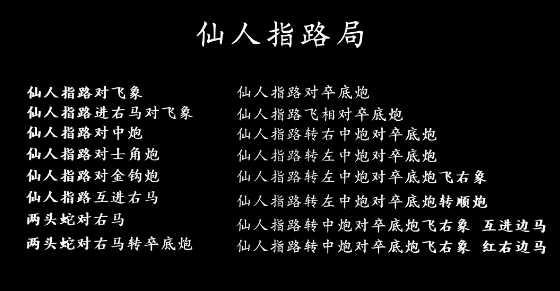

## 古谱

### 橘中秘

#### 弃马十三招

##### 炮2进7打马

黑吃马后，红炮八进五。黑有三种应招。

退底马变

前车退一

炮5平6，炮八平五，将6退1，后炮平四，黑逃炮。车六平五，

炮5平7，车六平四，炮7平6，炮八平五

后车进七

退炮打马变

退车保马变。里面有士6进5与士4进5两种。士6进5速败。士4进5又分（卒3进1与车2进4）

##### 士6进5

#### 顺炮横车破直车他先上马弃马局

##### 左马正起变

38：37

炮7平8或车8进2（44:24，车九平四，后面有鞭打二怪）。

##### 对边兵变

48:01

黑应招

马7退9，速败。

炮5退1，红大优。

车8进2，黑有炮2进6护中卒。

#### 顺炮横车破直车用马局

## 杀法大全

10/575

## 象棋路边摊

85/3715

