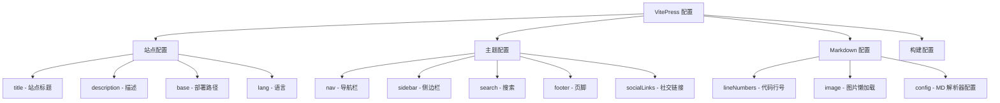

# VitePress 功能展示

深入了解 VitePress 提供的强大功能。

## 配置总览



## 核心功能

### 🔍 本地搜索

VitePress 内置本地搜索引擎，基于 MiniSearch：

- **零配置**：只需设置 `search: { provider: 'local' }`
- **实时搜索**：输入即搜索，无需等待
- **中文友好**：支持中文分词
- **键盘导航**：`Ctrl+K` 打开搜索，`↑↓` 选择，`Enter` 跳转

试试按 `Ctrl+K` 搜索 "Markdown"！

### 🌐 多语言支持

VitePress 原生支持国际化：

```ts
// 中文站点
export default defineConfig({
  lang: 'zh-CN',
  themeConfig: {
    // 中文化 UI 文本
    outline: { label: '页面导航' },
    docFooter: { prev: '上一页', next: '下一页' },
    darkModeSwitchLabel: '主题',
  }
})
```

### 🎨 主题定制

VitePress 支持多种定制方式：

**方式一：CSS 变量覆盖**

```css
:root {
  --vp-c-brand-1: #3b82f6;
  --vp-c-brand-2: #2563eb;
}
```

**方式二：Vue 组件（无布局闪烁）**

通过 `.vitepress/theme/index.ts` 注册全局组件：

```ts
import DefaultTheme from 'vitepress/theme'
import MyComponent from './MyComponent.vue'

export default {
  extends: DefaultTheme,
  enhanceApp({ app }) {
    app.component('MyComponent', MyComponent)
  }
}
```

**方式三：完全自定义布局**

```ts
import { h } from 'vue'
import DefaultTheme from 'vitepress/theme'

export default {
  extends: DefaultTheme,
  Layout: () => {
    return h(DefaultTheme.Layout, null, {
      // 使用插槽覆盖默认布局
    })
  }
}
```

### 🧩 内置组件

VitePress 提供了一些内置的 Vue 组件（无需导入）：

```md
<!-- 徽章 -->
<Badge type="info" text="新功能" />
<Badge type="tip" text="提示" />
<Badge type="warning" text="注意" />
<Badge type="danger" text="重要" />
```

实际效果：

<div style="display:flex;gap:0.5rem;margin:1rem 0;">
  <Badge type="info" text="新功能" />
  <Badge type="tip" text="提示" />
  <Badge type="warning" text="注意" />
  <Badge type="danger" text="重要" />
</div>

### 📦 静态资源处理

资源放在 `docs/public/` 目录下：

```
docs/
├── public/
│   ├── logo.svg       # 通过 /logo.svg 引用
│   └── images/
│       └── photo.png  # 通过 /images/photo.png 引用
└── notes/
    └── post.md        # 也可以用相对路径 ./logo.svg
```

### ⚡ 构建优化

VitePress 基于 Vite，构建极快：

```bash
# 开发模式 - 毫秒级热更新
npm run docs:dev

# 生产构建 - 几秒完成
npm run docs:build

# 本地预览构建结果
npm run docs:preview
```

构建产物在 `docs/.vitepress/dist/`，是纯静态文件，可以部署到任何静态托管服务。

### 🔗 路由和链接

```md
<!-- 内部链接（自动处理 base） -->
[快速开始](/guide/getting-started)

<!-- 相对链接 -->
[相对页面](./markdown-demo)

<!-- 外部链接 -->
[VitePress 官网](https://vitepress.dev)

<!-- 锚点 -->
[跳转到路由部分](#-路由和链接)
```

## 部署选项

| 平台 | 特点 | 难度 |
|------|------|------|
| **GitHub Pages** | 免费、自动部署 | ⭐ 简单 |
| **Vercel** | 自动 HTTPS、全球 CDN | ⭐ 简单 |
| **Netlify** | 拖拽部署、表单功能 | ⭐ 简单 |
| **Cloudflare Pages** | 全球加速、无限带宽 | ⭐ 简单 |
| **自建服务器** | Nginx + 静态文件 | ⭐⭐ 中等 |

## 下一步

- 📖 阅读 [VitePress 官方文档](https://vitepress.dev)
- 🎨 探索 [VitePress 主题市场](https://github.com/topics/vitepress-theme)
- 🚀 配置 [GitHub Actions 自动部署](https://vitepress.dev/guide/deploy#github-pages)
- 📝 开始编写你的第一篇笔记！
