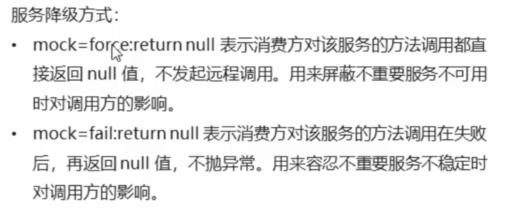
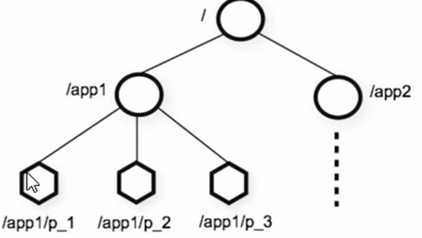
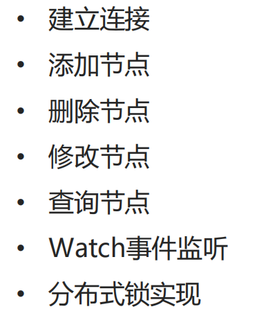
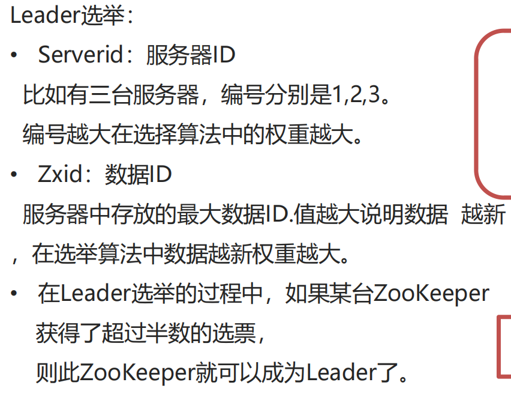

# 微服务

# 讲义网址
https://my.feishu.cn/wiki/FYNkwb1i6i0qwCk7lF2caEq5nRe?chunked=false

# 微服务

## 动机

单体项目越来越大，团队冲突、扩展困难

|**问题**|**通俗解释**|解决方法|
|---|---|---|
|**服务发现**|A服务怎么知道B服务在哪台机器、哪个端口？|注册中心|
|**配置管理**<br>|10个服务的数据库密码、开关配置怎么统一管理？|配置中心|
|**远程调用**|A服务怎么像调用本地方法一样，调用B服务？|本质是网络请求（RPC、HTTP）|

**微服务架构 = 分布式 \+ 每个服务集群化**

# RPC

Remote Procedure Call，解决远程调用的问题，像调用本地方法一样调用远程服务

### 核心概念

```Plain Text
┌─────────────────────────────────────────────────────────────┐
│                      RPC 的核心概念                          │
├─────────────────────────────────────────────────────────────┤
│  服务提供者 (Provider)  │  提供服务的服务端                   │
│                        │  "用户系统暴露 getUserById 方法"     │
├─────────────────────────────────────────────────────────────┤
│  服务消费者 (Consumer)  │  调用服务的客户端                   │
│                        │  "订单系统调用 getUserById"          │
├─────────────────────────────────────────────────────────────┤
│  注册中心 (Registry)   │  服务地址注册和发现                 │
│                        │  "提供者告诉注册中心自己在哪里"      │
│                        │   "消费者去注册中心找提供者地址"      │
├─────────────────────────────────────────────────────────────┤
│  代理 (Proxy)          │  RPC 框架自动生成，让你像本地调用    │
│                        │  你调用代理，代理负责网络通信        │
└─────────────────────────────────────────────────────────────┘
```

### 完整流程

```Plain Text
订单系统（消费者）                      用户系统（提供者）
     │                                      │
     │  1. 调用代理的 getUserById 方法       │
     ├─────────────────────────────────────→│
     │                                      │
     │  2. 代理把调用信息打包                │
     │     （方法名、参数、序列化）          │
     │                                      │
     │  3. 通过注册中心找到用户系统地址      │
     │     （服务发现）                     │
     │                                      │
     │  4. 发送网络请求                     │
     ├─────────────────────────────────────→│
     │                                      │
     │                                      │ 5. 反序列化参数
     │                                      │ 6. 执行 getUserById
     │                                      │
     │  7. 返回结果                        │
     │←─────────────────────────────────────┤
     │                                      │
     │  8. 反序列化结果                     │
     │  9. 返回给调用方                     │
```

## Dubbo

它本身提供的是一整套“服务治理能力”，包括：

1\. RPC远程调用（核心能力）
2\. 服务注册/发现机制（可插拔）
3\. 负载均衡
4\. 容错机制
5\. 路由控制


**Dubbo 自己实现 RPC 调用能力，但注册中心是可插拔的，通常由 ZooKeeper / Nacos 等外部系统提供。**


假设你要调用 `DataQueryService` 的 `queryRiskData` 方法，没有 Dubbo 你需要做什么？

点击查看答案

1. 知道对方服务的 IP、端口

2. 约定接口格式（JSON? XML? 自定义?）

3. 用 HttpClient 发送请求

4. 把参数序列化成字符串

5. 处理网络异常、超时

6. 把响应反序列化成 Java 对象

7. 处理各种错误码

**有了 Dubbo 后**：直接 `dataQueryService.queryRiskData(...)` 一行搞定。

### 配置

```YAML
dubbo:
  application:
    name: user-service          *# 应用名称*

*  *registry:
    address: zookeeper://127.0.0.1:2181   *# 注册中心地址,告诉 Dubbo，服务注册到哪个 Zookeeper*

*  *protocol:
    name: dubbo                 *# 协议,用什么协议通信 监听 xxx 端口*
*    *port: 20880                 *# 服务暴露端口*
*  *consumer:            # 引用别人的接口
    timeout: 3000      *# 超时时间（ms）*
*    *retries: 2         *# 重试次数*
*    *check: *false       # 启动时不检查提供者是否存在*
*  *provider:            # 暴露给别人的接口
    timeout: 3000
    retries: 2
    loadbalance: random
  scan:
    base-packages: com.example.service    *# Dubbo 服务扫描包*
```

### 关键参数

20881  —— 业务通信（RPC）

22223  —— 管理维护（QoS）


同一个参数可以配在多个地方，优先级从高到低：

```Plain Text
方法级 > 接口级（reference）> 服务端（service）> 全局默认
```

1\. `timeout` \- 超时时间

```Plain Text
<dubbo:reference ... timeout="3000"/>
```

**注意**：

- 超时后 Dubbo 会报 `TimeoutException`

- 可以配在 `reference`（消费者）或 `service`（提供者），消费者优先级更高

- 需要根据实际业务评估（查询快、计算慢）

2\. `retries` \- 重试次数

```Plain Text
<dubbo:reference ... retries="2"/>
```

**经典坑**：`timeout=1s` \+ `retries=2`，调用一次可能实际执行 3 次（1 次原 \+ 2 次重试）。

3\. `version` \- 服务版本

```Plain Text
<!-- 提供者暴露 v1.0 -->
<dubbo:service interface="UserService" version="1.0" ref="userServiceV1"/>

<!-- 提供者暴露 v2.0 -->
<dubbo:service interface="UserService" version="2.0" ref="userServiceV2"/>

<!-- 消费者调用 v1.0 -->
<dubbo:reference id="userService" interface="UserService" version="1.0"/>
```

**用途**：

- 灰度发布：先让部分消费者调用新版本

- 多版本共存：新旧接口同时存在，逐步迁移。实现原理：同时部署多个不同版本的服务实例

4\. `check` \- 启动检查

```Plain Text
<dubbo:reference ... check="false"/>
```

**场景**：服务 A 依赖服务 B，但 A 启动时 B 还没启动，设置 `check=false` 可以让 A 先启动。

5\. `connections` \- 连接数

```Plain Text
<dubbo:reference ... connections="1"/>
```

限制消费者到提供者的最大连接数，默认是共享连接，一般不需要改。

### 高级特性

#### 序列化

我们只需要在定义pojo类时实现Serializable接口即可 

一般会定义一个公共的pojo模块，让生产者和消费者都依赖该模块。

#### **地址缓存**

**注册中心挂了，服务是否可以正常访问？ **

• 可以，因为dubbo服务消费者在第一次调用时， 会将服务提供方地址缓存到本地，以后在调用则不会访问注册中心。 

• 当服务提供者地址发生变化时，注册中心会通知服务消费者。

#### **超时与重试**

@DubboService\(version = "1\.0\.0",timeout = 1000,retries=3\)

• 服务消费者在调用服务提供者的时候发生了阻塞、等待的情形，这个时候，服务消费者会一直等待下去。 

• 在某个峰值时刻，大量的请求都在同时请求服务消费者，会造成线程的大量堆积，势必会造成雪崩。 

• dubbo 利用超时机制来解决这个问题，设置一个超时时间，在这个时间段内，无法完成服务访问，则自动断开连接。 

• 使用timeout属性配置超时时间，默认值1000，单位毫秒。

• 设置了超时时间，在这个时间段内，无法完成服务访问，则自动断开连接。 

• 如果出现网络抖动，则这一次请求就会失败。 

• Dubbo 提供重试机制来避免类似问题的发生。 

• 通过 retries 属性来设置重试次数。默认为 2 次。


**多版本**

• 灰度发布：当出现新功能时，会让一部分用户先使用新功能，用户反馈没问题时，再将所有用户迁移到新功能。 

• dubbo 中使用version 属性来设置和调用同一个接口的不同版本

#### **负载均衡**

负载均衡策略（4种）： 

• Random ：按权重随机，默认值。按权重设置随机概率。 

• RoundRobin ：按权重轮询。 

• LeastActive：最少活跃调用数，相同活跃数的随机。 

• ConsistentHash：一致性 Hash，相同参数的请求总是发到同一提供者。

#### **集群容错**

集群容错模式： 

• Failover Cluster：失败重试。默认值。当出现失败，重试其它服务器 ，默认重试2次，使用 retries 配置。一般用于读操作 

• Failfast Cluster ：快速失败，只发起一次调用，失败立即报错。 通常用于写操作。 

• Failsafe Cluster ：失败安全，出现异常时，直接忽略。返回一个空结果。 

• Failback Cluster ：失败自动恢复，后台记录失败请求，定时重发。通常用于消息通知操作。 

• Forking Cluster ：并行调用多个服务器，只要一个成功即返回。 

• Broadcast Cluster ：广播调用所有提供者，逐个调用，任意一台报错则报错。

#### **服务降级**



# 注册中心

只有RPC还不行。

问题：

1. 服务地址不知道

2. 服务挂了怎么办

3. 如何动态扩容

4. 

## Zookeeper

### 命令操作

#### 数据模型



这里面的每一个节点都被称为： ZNode，每个节点上都会保存自己的数据和节点信息。 

• 节点可以拥有子节点，同时也允许少量（1MB）数据存储在该节点之下。 

• 节点可以分为四大类： 

• PERSISTENT 持久化节点 

• EPHEMERAL 临时节点 ：\-e 

• PERSISTENT\_SEQUENTIAL 持久化顺序节点 ：\-s 

• EPHEMERAL\_SEQUENTIAL 临时顺序节点 ：\-es

#### 服务端常用命令

现在一般用docker

docker start zookeeper\-dev

docker stop zookeeper\-dev

docker restart zookeeper\-dev

docker ps

docker logs zookeeper\-dev

#### 客户端常用命令

用的不多

### JavaAPI操作




#### watch事件监听

ZooKeeper 里的 **watch（监听机制）**，你可以把它理解成一句话：

> **“我先盯着这个节点，一旦它发生变化，你就通知我。”**
> 
> 

🧠 一、通俗理解

你可以把 ZooKeeper 想成一个“共享黑板”：

A 写了一个信息

B 说：“这个位置有变化你要通知我”

👉 B 就是 **watcher（监听者）**

⚡ 二、watch 监听什么？

ZooKeeper 支持监听三类变化：

1️⃣ 节点数据变化

set /test "new value"

👉 监听者会收到通知

2️⃣ 节点是否存在变化

create /test
delete /test

👉 监听“有没有这个节点”

3️⃣ 子节点变化

ls /dubbo

👉 监听子节点新增 / 删除（比如服务上线/下线）

🔔 三、watch 是怎么工作的？

关键点只有一句：

> ❗ watch 是“一次性”的
> 
> 

举个例子：

第一步：注册监听

client\.getData\(\)
      \.usingWatcher\(event \-\> \{
          System\.out\.println\("节点变化了！"\);
      \}\)
      \.forPath\("/test"\);

第二步：触发事件

set /test "hello"

👉 控制台输出：

节点变化了！

⚠️ 重要：

watch 触发一次就失效了

如果你还想监听，要重新注册。

🔥 四、watch 在 Dubbo 里的作用（重点）

Dubbo \+ ZooKeeper 本质依赖 watch：

Provider 上线

/dubbo/com\.xxx\.UserService/providers

👉 Consumer watch 这个节点

Provider 变化

新服务上线

服务下线

IP 变化

👉 ZK 通知 Consumer

Consumer 就会：

更新服务列表

重新负载均衡

🧠 五、watch 的本质（非常重要）

ZooKeeper watch 不是：

❌ 持续监听

❌ 事件推送系统

而是：

> ✔ 一次性回调 \+ 需要重新注册
> 
> 

⚖️ 六、和其他技术对比

### 集群




# 配置中心

每个服务器有自己的配置，这样有问题

1. 配置分散
2. 改配置要重新发布
3. 多环境混乱

有了配置中心，可以将配置集中管理、可以**动态刷新**、可以进行多环境管理

**常见的配置中心**

1. Spring Cloud Config
2. Nacos，注册中心与配置中心
3. Apollo

**对比**

Spring Cloud Config作为官方提供的配置中心，适合学习和刚开始使用分布式框架的项目使用
Nacos 作为阿里2018年开源的产品，有阿里背书，且服务发现和配置集与一体。但是从目前的发展来看，阿里开发重心在于服务发
现端，配置中心相关功能开发相对滞后，适合中小型企业使用
Apollo 是携程2016年开源的配置中心，经历了5年的迭代，现在已经是一个很完善的产品，能满足大型互联网的大多数需要

## Apollo

Apollo（阿波罗）是携程框架部门研发的分布式配置中心，能够集中化管理应用的不同环境、不同集群的配置，配 

置修改后能够实时推送到应用端，并且具备规范的权限、流程治理等特性，适用于微服务配置管理场景。

Apollo —— "配置中心"，**解决问题：配置管理**

```Plain Text
传统方式（痛点）：
  10个服务，每个都有数据库密码、开关配置
  要改一个密码 → 改10次配置 → 重启10个服务 → 累死

Apollo方式：
  所有配置统一放在Apollo平台
  改一次密码 → Apollo自动推送到所有服务 → 不用重启（热发布）
```

