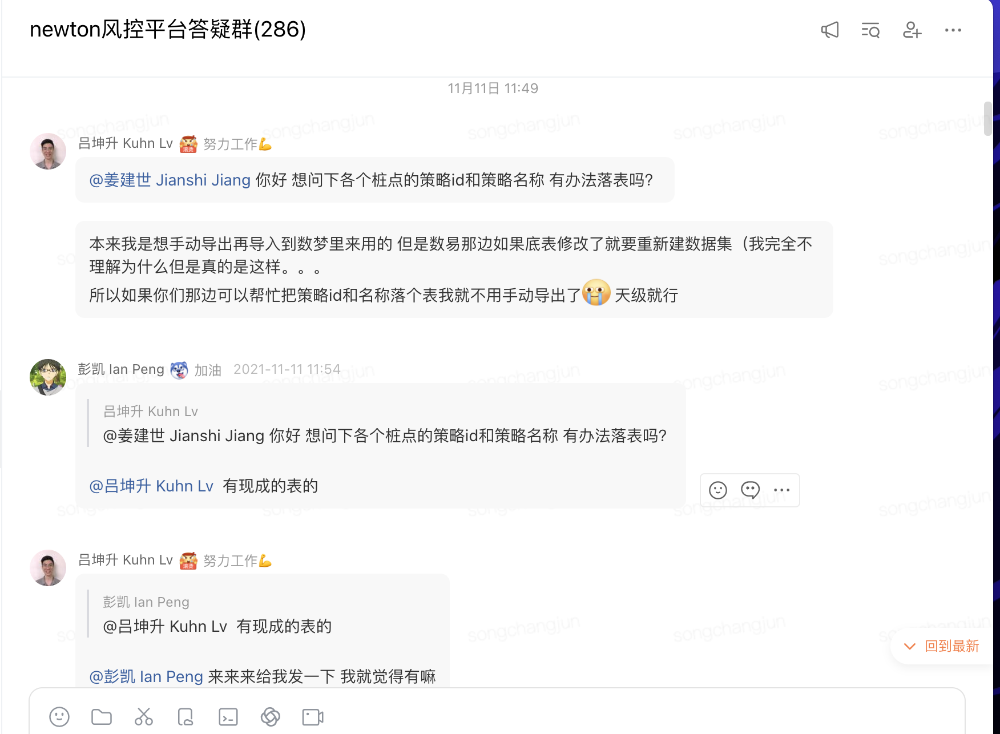
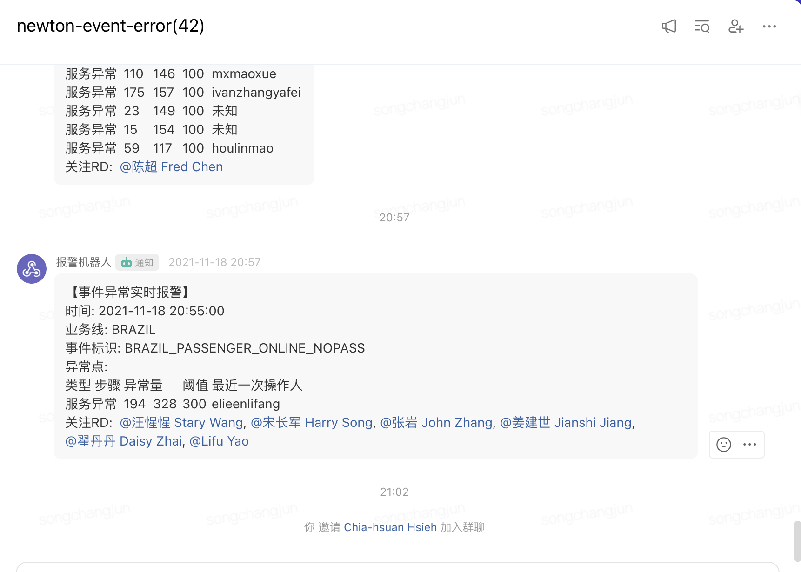

# 后端开发学习计划

# Black 模块学习计划

🏗️ 核心框架

apollo

1. 初步认识

2. 黑马视频过一遍

3. 再过一遍，跟着操作

|技术|版本|用途|
|---|---|---|
|**Spring Framework**|5\.3\.30 |IoC/DI容器、AOP、事件机制、定时任务|
|**Apache Dubbo**|\(via april\-dubbo\)|RPC远程服务调用框架|
|**ZooKeeper**|\(Dubbo registry\)|服务注册与发现|

apollo

💾 数据存储

|技术|版本|用途|
|---|---|---|
|**MongoDB**|3\.12\.10 driver|NoSQL文档数据库（主存储）|
|**Jongo**|1\.3\.0|MongoDB的Java ODM（对象文档映射）|

📨 消息队列

|技术|版本|用途|
|---|---|---|
|**DDMQ \(Carrera\)**|\(via april\-mw\-ddmq\)|滴滴内部消息队列，缓存同步|

🛡️ 服务治理

|技术|版本|用途|
|---|---|---|
|**Alibaba Sentinel**|1\.8\.6|限流、熔断、降级、系统保护|

⚙️ 内部框架

|技术|版本|用途|
|---|---|---|
|**April**|0\.1\.157|滴滴内部框架（common/dubbo/ddmq/jongo/sentinel/log封装）|
|**risk\-newton\-core**|1\.2\.99|Newton平台核心库|
|**taxi\-log**|\(parent\)|滴滴统一日志框架|
|**KMS**|1\.0\.16|滴滴密钥管理（敏感配置解密）|

🔧 工具库

|技术|用途|
|---|---|
|**Lombok** 1\.18\.20|消除样板代码（@Data/@Getter等）|
|**Google Guava**|集合工具、Preconditions|
|**Alibaba Fastjson**|JSON序列化/反序列化|
|**Apache Commons**|lang/lang3/collections/collections4/beanutils|
|**AspectJ**|AOP切面编程|
|**Joda\-Time**|日期时间处理|
|**Apache HttpClient** 4\.5\.10|HTTP客户端|
|**dnsjava** 3\.3\.1|DNS解析|
|**cglib**|动态代理|
|**JUnit**|单元测试|

📊 监控/指标

|技术|用途|
|---|---|
|**xiaoju metric** 1\.7\.2|指标上报|

🐳 部署

|技术|用途|
|---|---|
|**Maven Assembly Plugin**|打包部署|

---

🎯 推荐学习顺序（按依赖关系排列）

第一阶段：基础必修

> 这些是看懂项目代码的前提
> 
> 

**Java 17** — 你已经会了

**Maven** — 项目构建、依赖管理、profile机制

**Lombok** — 理解 `@Data`、`@Getter`、`@Builder` 等注解（本项目大量使用）

**Log4j2 \+ SLF4J** — 日志框架，贯穿所有代码

第二阶段：核心框架

> 这是项目的骨架，必须深入掌握
> 
> 

**Spring Framework** — IoC/DI（`@Service` `@Value` `@Resource`）、ApplicationEvent事件机制、`@Scheduled` 定时任务、`@Configuration`\+`@Bean` Java Config

**AspectJ \+ Spring AOP** — `@Aspect` `@Around` `@Pointcut`，理解切面编程

第三阶段：数据层

> 项目的主存储是MongoDB
> 
> 

**MongoDB 基础** — CRUD、分片、读写关注（ReadPreference/WriteConcern）

**Jongo** — MongoDB的ODM框架（`MongoCollection`、`@MongoId`、`@MongoObjectId`）

第四阶段：RPC \& 中间件

> 项目通过Dubbo对外提供服务
> 
> 

**ZooKeeper 基础** — 理解服务注册发现原理

**Apache Dubbo** — provider/consumer模型、RpcContext、filter链、线程模型

**消息队列基础** → **DDMQ** — 理解异步消息、缓存同步模式

第五阶段：服务治理

> 高可用保障
> 
> 

**Alibaba Sentinel** — `@SentinelResource`、FlowRule流控、`SphU.entry()`、熔断降级

第六阶段：辅助工具（用到时再深入）

> 按需学习，不必系统学
> 
> 

**Google Guava** — Lists/Maps/Preconditions 工具方法

**Alibaba Fastjson** — JSON\.parseObject/JSONObject/JSONArray

**Apache Commons** — StringUtils/CollectionUtils 工具方法

**Apache HttpClient** — HTTP调用

**KMS** — 密钥管理概念（滴滴内部，外部不需要）

---

📋 速查：本项目关键技术特征

**没有** MyBatis、MySQL、Redis、Kafka、Elasticsearch

**用 MongoDB \+ Jongo** 做唯一存储，自己实现了分库分表（按hashCode）

**用本地 HashMap 做缓存**，通过 DDMQ \+ Spring Event \+ 定时刷新 三级同步

**用 Dubbo \+ ZooKeeper** 做 RPC，提供 5 个 Dubbo Service

**用 Sentinel** 对 7 个核心接口做限流保护

**Java 17** 运行

要开始学的话，建议从 **Spring Framework** 开始，边学边对照这个项目的代码看。

# 其他

好的，我来根据项目的实际技术栈，为你整理一份从 Java SE 到这个项目的学习路线。

---

从 Java SE 到 risk\-global 项目学习路线

你的起点：Java SE

假设你已经掌握：

Java 基础语法、面向对象、集合框架

异常处理、IO 流、多线程基础

JDBC 基础（连数据库）

---

第一阶段：基础工具 \& 工程化（1\-2 周）

1\. Maven

> **项目中所有模块都用 Maven 构建**
> 
> 

`pom.xml` 的结构（groupId、artifactId、version、dependencies）

依赖传递、scope（compile/provided/test）

多模块项目结构（本项目就是典型多模块）

常用插件（compiler、assembly、surefire）

2\. Git

基本操作：clone、pull、commit、branch、merge

代码冲突解决

3\. Linux 基础命令

查看日志（`tail -f`、`grep`、`less`）

进程管理（`ps`、`top`、`jstack`）

---

第二阶段：核心框架 — Spring（3\-4 周）⚠️ 重点

⚠️ 注意：大部分模块用的是**传统 Spring \+ XML 配置**，不是 Spring Boot！

> 本项目 spring 版本：`Spring 4.2.3 ~ Spring 5.3.34`，只有 `tesla-global-mgr` 是 Spring Boot 3
> 
> 

Spring Core（必学）

IoC 容器原理

`ApplicationContext` vs `BeanFactory`

Bean 生命周期、作用域（singleton/prototype）

**XML 配置方式**：`<bean>`、`<property>`、`<constructor-arg>`

注解方式：`@Component`、`@Autowired`、`@Qualifier`

Spring MVC（必学）

> 项目入口：
> 
> WAR 部署：`risk-global-newton-mgr`、`risk-global-gateway`
> 
> 独立启动：`Bootstrap.java` \+ `ClassPathXmlApplicationContext`
> 
> 

DispatcherServlet 处理流程

`@Controller`、`@RequestMapping`、`@ResponseBody`

拦截器（Interceptor）vs 过滤器（Filter）

XML 配置 MVC 的方式

Spring AOP

代理模式（JDK 动态代理 vs CGLIB）

切面、切点、通知类型

Spring Boot（次学）

> 只用在 `tesla-global-mgr` 模块
> 
> 

自动配置原理

`application.yml` 配置

Starter 机制

与 Spring XML 方式的区别

---

第三阶段：数据库 \& 持久化（2\-3 周）

1\. MySQL \+ MyBatis（必学）

> 项目使用：`risk-global-newton-mgr`、`risk-global-newton-data`
> 
> 

**重要**：项目用的是 MyBatis，不是 MyBatis\-Plus

MyBatis XML Mapper 写法（`<select>`、`<insert>`、`<resultMap>`）

动态 SQL（`<if>`、`<foreach>`、`<choose>`）

`SqlSessionFactory`、`SqlSessionTemplate`

MyBatis 与 Spring 的整合配置（`<bean class="org.mybatis.spring.SqlSessionFactoryBean">`）

分页（PageHelper）

2\. MongoDB（必学）

> 本项目大量使用 MongoDB
> 
> 

文档型数据库概念（区别于 MySQL）

CRUD 操作

本项目使用 `mongo-java-driver` \+ `jongo`（不是 Spring Data MongoDB）

连接池配置

3\. Redis / Codis（必学）

> 项目使用 Didi 的 Codis（Redis 集群方案）
> 
> 

Redis 五种基本数据类型

Jedis 客户端使用

Codis 概念（分布式 Redis 代理）

缓存穿透、击穿、雪崩

---

第四阶段：RPC \& 分布式（2\-3 周）

1\. Dubbo（必学）⚠️ 最核心的通信方式

> **所有后端模块都用 Dubbo 做 RPC 通信**
> 
> 

RPC 概念（为什么需要远程调用）

Dubbo 架构：Provider、Consumer、Registry

XML 配置方式（`<dubbo:service>`、`<dubbo:reference>`）

**本项目使用 Didi 内部的 ****`april-dubbo`**** 封装**，了解即可，本质相同

Zookeeper 注册中心概念

超时、重试、负载均衡、集群容错

2\. 消息队列（MQ）

> 项目用了多种 MQ：
> 
> 

|MQ|使用模块|学习优先级|
|---|---|---|
|Kafka|newton\-data, gateway|⭐⭐⭐ 最通用|
|RocketMQ|newton\-mgr, newton\-mq|⭐⭐|
|Carrera|newton\-mq, remote|⭐（Didi 内部 Kafka 封装）|
|DDMQ|newton\-data|⭐（Didi 内部）|

学习重点：

Kafka 基础概念：Topic、Partition、Consumer Group

消息生产和消费的语义（at\-least\-once、at\-most\-once）

幂等性设计

消息顺序性保证

---

第五阶段：安全 \& 其他中间件（1\-2 周）

1\. Apache Shiro（必学）

> 项目使用：`risk-global-newton-mgr`（v1\.12\.0）、`tesla-global-mgr`（v2\.0\.5）
> 
> 

Subject、SecurityManager、Realm

认证（Authentication）和授权（Authorization）

Filter 链配置

项目中对接了 Okta SSO

2\. 日志框架

> 项目统一使用 Log4j2 2\.20\.0
> 
> 

Log4j2 配置（XML 格式）

日志级别、Appender、PatternLayout

与 Slf4j 的关系

3\. Elasticsearch

> 使用于 `risk-global-newton-mgr`（v2\.3\.3）
> 
> 

倒排索引概念

基本的 DSL 查询

4\. Thrift

> 使用于 `risk-global-gateway`、`risk-global-remote`
> 
> 

了解即可，项目主要用于跨服务通信

---

第六阶段：项目特有框架（入职后学）

这些是 Didi 内部框架，外面学不到，进公司后看内部文档：

|框架|作用|使用模块|
|---|---|---|
|**April Framework**|Didi 内部集成框架（封装 Dubbo、Sentinel、Redis 等）|所有模块|
|**Apollo**|配置中心（类似 Nacos）|newton\-data 等|
|**Sentinel**|流量控制、熔断降级|newton\-data、remote|
|**911**|降级系统|newton\-mq、newton\-data|
|**Warden SDK**|鉴权|gateway|
|**Carrera**|Kafka 的内部封装|newton\-mq、remote|
|**DDMQ**|Didi 分布式消息队列|newton\-data|

---

第七阶段：前端（了解即可）

thor\-mobile — Vue 3 \+ TypeScript

> 如果你只做后端，达到"能看懂"的程度就行
> 
> 

Vue 3 基础组件和响应式

Vant UI 组件库

Axios 发 HTTP 请求

`npm install` / `npm run dev` 能把项目跑起来

---

学习优先级总结（按紧迫度排序）

🔴 最高优先（第一周就要开始看）:
   ├── Maven（不然项目都导入不了）
   ├── Spring Core \+ Spring MVC（项目骨架）
   └── XML 配置方式（不要只看 Spring Boot 教程！）

🟡 核心技能（前一个月搞懂）:
   ├── MyBatis（操作 MySQL）
   ├── MongoDB（项目大量使用）
   ├── Redis/Codis（缓存核心）
   ├── Dubbo（服务间调用）
   └── Kafka（消息队列）

🟢 进阶（两个月内掌握）:
   ├── Shiro（安全框架）
   ├── Log4j2
   └── Elasticsearch

🔵 内部框架（入职后看文档）:
   ├── April Framework
   ├── Apollo 配置中心
   ├── Sentinel 限流
   └── 其他 Didi 内部组件

---

学习资源推荐

|技术|推荐资源|
|---|---|
|Spring|《Spring 实战》第5版 \+ 官方文档|
|MyBatis|MyBatis 官方中文文档 \+ 看项目中的 XML Mapper|
|MongoDB|MongoDB University 免费课程|
|Redis|《Redis 设计与实现》\+ 官网互动教程|
|Dubbo|Apache Dubbo 官方中文文档|
|Kafka|《Kafka 权威指南》前5章|
|Shiro|官方 10 分钟教程 \+ 看 `spring-shiro.xml` 配置|

---

本地启动项目的最小路径

建议按这个顺序来，每步成功后再往下走：

**`mvn clean install`** 整个项目根目录（可能会有依赖拉不下来，需要配置内部 Maven 仓库）

先启动不依赖外部的模块：**`tesla-global-mgr`**（Spring Boot，最简单）

再启动 **`risk-global-newton-mgr`**（WAR 包，需要 Tomcat/Jetty）

最后启动 MQ 消费者模块：**`risk-global-newton-mq`**

---

避坑提醒 🚨

**不要只看 Spring Boot 教程** — 这个项目 90% 的模块是传统 Spring \+ XML 配置，《Spring Boot 实战》里学不到 `web.xml`、`applicationContext.xml` 这些

**MyBatis 不是 MyBatis\-Plus** — 外面很多教程讲 MyBatis\-Plus，但项目用的是原生 MyBatis，需要手写 XML

**MongoDB 不是 Spring Data MongoDB** — 项目用 `mongo-java-driver` \+ `jongo`，API 风格不一样

**先看懂 XML 配置再去看代码** — `src/main/resources/spring/` 下的 XML 文件是整个项目的骨架

**内部依赖是最大障碍** — `risk-newton-dubbo`、`april-*` 这些是 Didi 内部包，本地不一定能从 Maven 中央仓库拉下来，先找人帮你配好内部仓库和 settings\.xml

从 Java SE 到这套风控系统的学习路线

你的起点 vs 目标

|你会的（Java SE）|你需要会的（这套系统）|
|---|---|
|基础语法、集合、IO|Spring IOC / AOP / MVC / Boot|
|JDBC（可能学过）|MyBatis ORM|
|单机程序|分布式微服务（Dubbo）|
|无中间件|MySQL \+ MongoDB \+ Redis \+ ES \+ Kafka/RocketMQ|
|纯 Java|Maven 构建、Lombok、MapStruct 等工具链|

这套系统是滴滴内部的企业级风控平台，技术栈较广。下面分 6 个阶段，由浅入深。

---

第一阶段：企业 Java 基础设施（1\-2 周）

**目标：能跑起来一个 Spring Boot 项目**

1\.1 Maven 构建工具

这套项目全是 Maven 管理，必须先会用

学 POM 坐标、依赖传递、多模块构建、profile 切换

对应项目里的 `pom.xml`、父 POM `risk-public-pom`

1\.2 Lombok

项目大量使用 `@Data`、`@Slf4j`、`@Builder` 等注解

不用手写 getter/setter/logger，但需要理解它生成的代码

1\.3 Jackson / Fastjson

JSON 序列化反序列化的基础，接口调用到处用

**动手：** 用 Maven 搭一个 Spring Boot 空项目，跑起来一个 Hello World 接口。

---

第二阶段：Spring 全家桶核心（2\-3 周）

**这套系统最核心的骨架，也是最值得花时间的地方**

2\.1 Spring IOC \& DI

`@Service`、`@Component`、`@Autowired`、`@Resource`

理解 Bean 生命周期、作用域（singleton/prototype）

这套项目所有模块都基于此

2\.2 Spring AOP

项目里日志切面、事务管理都用 AOP

理解代理模式和 `@Aspect` 用法

2\.3 Spring MVC

`@RestController`、`@RequestMapping`、参数绑定、拦截器

`risk-newton-api` 模块就是这个层

2\.4 Spring Boot 自动配置

理解 `application.yml`、profile（dev/test/stable/online）

每个模块 `src/main/resources` 下的配置文件

2\.5 Spring Transaction

`@Transactional` 声明式事务

理解传播行为和隔离级别

**动手：** 写一个带 Service \+ Mapper \+ Controller 的 CRUD 接口。

---

第三阶段：数据层（2\-3 周）

**这套系统用到的存储和中间件非常多，按优先级学**

3\.1 MyBatis（最优先）

项目用 MyBatis，**不是** MyBatis\-Plus

XML Mapper、`@MapperScan`、动态 SQL、`<foreach>`、参数映射

对应项目里每个模块的 `*Mapper.xml` 和 `*Dao` 类

3\.2 MySQL \+ 连接池

Mysql Connector/J、Druid 连接池配置

基本的索引和慢查询排查思路

3\.3 Redis（Jedis）

项目缓存、分布式锁场景会用到

字符串/哈希/列表等基本数据结构

3\.4 MongoDB

项目里用 mongo\-java\-driver 和 Spring Data MongoDB

文档型数据库，风控场景适合存非结构化数据

3\.5 Elasticsearch（了解）

部分模块用于搜索和分析

了解索引概念和基本查询

**动手：** 用 MyBatis 写多表关联查询，用 Redis 做缓存。

---

第四阶段：微服务通信（2\-3 周）

**从单机进到分布式，这是这套系统的核心架构**

4\.1 Dubbo RPC（重点）

项目用 Dubbo 2\.7\.x 做微服务调用

学 provider/consumer 模型、服务注册发现、序列化协议

对应 `risk-remote`、`risk-newton-remote`、`risk-newton-mq` 里的远程调用

4\.2 HTTP 客户端

**Apache HttpClient** — 传统同步调用

**OkHttp** — 项目也大量使用，更现代的异步 HTTP 客户端

RestTemplate 的使用

4\.3 配置中心（Apollo / DISF）

滴滴内部的 Apollo SDK 和 DISF 服务框架

理解为什么配置要做成集中式的

**动手：** 搭两个微服务，通过 Dubbo 互相调用。

---

第五阶段：消息队列与其他中间件（1\-2 周）

5\.1 Kafka

`april-mw-kafka` 内部封装

生产者消费者模型、Topic、Partition 概念

5\.2 RocketMQ

项目也用了，理解它和 Kafka 的区别场景

5\.3 Sentinel（限流熔断）

项目用 Sentinel 1\.8\.6 做保护

理解熔断、降级、限流的基本概念

---

第六阶段：按模块渐进式阅读代码

学完前五个阶段后，按以下顺序看项目代码：

|顺序|模块|为什么先看这个|
|---|---|---|
|1|**risk\-newton\-core**|核心领域对象、公共枚举、常量，不依赖其他业务模块|
|2|**risk\-newton\-api**|API 定义层，只有接口声明和 DTO，没有实现逻辑|
|3|**risk\-newton\-data**|数据访问层，MyBatis Mapper，理解数据怎么存取|
|4|**risk\-newton\-config**|配置模块，理解系统有哪些配置项|
|5|**risk\-newton\-mq**|消息队列，理解事件怎么传递|
|6|**risk\-newton\-compute**|计算引擎，风控的核心算分逻辑|
|7|**risk\-newton\-strategy**|策略模块，风控规则怎么配和执行|
|8|**risk\-newton\-black**|黑名单，具体业务场景|
|9|**risk\-newton\-monitor**|监控，观察系统运行|
|10|**risk\-newton\-mgr / risk\-newton\-event**|管理和事件模块|
|11|**risk\-newton\-hackcase**|案件模块|
|12|**risk\-validate / risk\-unusual\-account**|校验和异常账号|
|13|**minos\-etl**|Spark/Scala 写的 ETL，最后再看|

每个模块阅读时抓住三点：

`src/main/java` 下的包结构和核心类

`pom.xml` 引了哪些依赖（就知道它用了什么技术）

`application.yml` 连了什么数据库和中间件

---

推荐学习顺序总结

Java SE 基础
  → Maven \+ Lombok \+ JSON
    → Spring IOC/AOP/MVC \+ Spring Boot
      → MyBatis \+ MySQL（此时就能看懂 risk\-newton\-data 了）
        → Redis \+ MongoDB \+ ES
          → Dubbo 微服务（此时能看懂 risk\-newton\-api / risk\-newton\-remote）
            → Kafka \+ Sentinel
              → 逐模块读代码 \+ 跟断点调试

按每天 2\-3 小时投入，**大约 2\-3 个月**能把这套系统的大体架构和技术栈理清楚。关键是边学边看代码，不要等"全学完"才看——学完 Spring 就可以看 core/api/data 了。

# 学习计划

晚餐补贴

打车报销

打车与发票

需要做的放一块

全部复制\+排期

要总结入职以来的日报

arthas vmtool

项目里面如果需要调试，是不是需要有请求，如果没请求就没有办法调试

1. 安装一个管理claude工具

2. dcc能不能区分模块

3. 

4. 迁移语雀

5. 写日报，finish

6. 

7. 

8. 配置apollo

9. 部署模块

10. 

11. 学习skill梳理事件代码：创建、解析、补全

12. 昨日进展：

13. 1\.梳理策略扩展数据、虚拟事件、报警

14. 2\.梳理接入层

15. 今日计划：

16. 1\.梳理mgr 和 config

17. 2\.启动 event 模块

18. 11:04\-11:50 梳理事件相关

19. 11:50\-14:00 午餐、阅读、午休

20. 14:00\-17:50 梳理策略相关

21. 19:00\-21:30 网关层

22. 整理飞书文档

23. 21:00 预约用车

24. 21:30\-22:30 AI 相关

25. 1\.梳理策略代码：策略组、策略执行引擎、处罚、虚拟事件

26. 2\.学习策略相关在newton平台的使用方式

27. 1\.梳理策略扩展数据、虚拟事件、报警

28. 

29. 2\.梳理接入层

gift桶改权限需求，根据需求制定开发计划

梳理 gift桶有哪些地方使用

确认newton gift 桶权限，评估能否Gauss也改为private

确认是否涉及代码改造

启动本地项目（一定要这样），然后再调

# **一、平台相关学习和底层实现**

要求：了解每一个模块的设计和代码实现，后续找时间选定一个主题安排一次组内串讲，历史串讲汇总：[http://wiki\.intra\.xiaojukeji\.com/pages/viewpage\.action?pageId=411450191](http://wiki.intra.xiaojukeji.com/pages/viewpage.action?pageId=411450191)

产品材料汇总：[https://cooper\.didichuxing\.com/knowledge/2200049362480/2202826160312](https://cooper.didichuxing.com/knowledge/2200049362480/2202826160312)

## **Newton**

### **1、了解平台功能**

newton入门wiki：

[http://wiki\.intra\.xiaojukeji\.com/pages/viewpage\.action?pageId=251140200](http://wiki.intra.xiaojukeji.com/pages/viewpage.action?pageId=251140200)

[http://wiki\.intra\.xiaojukeji\.com/pages/viewpage\.action?pageId=1058117277](http://wiki.intra.xiaojukeji.com/pages/viewpage.action?pageId=1058117277)

要求：

1\.1 在newton\-stable环境，熟悉平台每一个功能，建议每个功能都操作一遍，并了解功能的作用

1\.2 关注newton答疑群以及查看聊天记录，通过用户提出的问题，跟随值班同学/桔伴了解对应的处理方式

1\.3 关注相关告警群，以及比如event服务产生的异常信息，分析解决，通过解决线上暴露的问题驱动熟悉平台的逻辑结构

1\.4 对线下stable环境所有模块、api包进行升级，同步master代码，并进行部署，熟悉newton开发的流程

1\.5 进行一次函数开发、服务开发（data写代码调用newton的一个桩点），并在平台进行配置，用事件测试这两种补全

### **2、事件**

- 事件的创建         

- 解析                 

- 补全                 

- 事件补全是利用已有的特征，经过一系列计算生成新特征的过程。

- 服务补全、函数补全、统计指标、条件指标、模型补全、评分卡补全

- 存储                 

- 熔断降级             

- 网关/MQ到事件流程     

### **3、策略**

- 策略组           

- 策略执行引擎     

- 处罚动作执行方式   

- 扩展数据         

- 虚拟事件         

- 报警降级         

### **4、名单库\&视图服务\&数据通道 **

- 名单库使用几种场景       

- 平台支持的数据视图服务     

- 数据通道的应用和执行方式   

### **5、基础元件 **

- 计数器                     

- 服务（视图服务/HTTP服务/）   

- 函数                     

- 处罚                       

- 侦测/异常日志           

- 评分卡

- 特征监控

- 特征质量监控

- 实时分析                   

### **6、学习排期**

## **Gauss**

### **1、了解平台功能**

Gauss平台wiki：

[http://wiki\.intra\.xiaojukeji\.com/pages/viewpage\.action?pageId=1058117320](http://wiki.intra.xiaojukeji.com/pages/viewpage.action?pageId=1058117320)

### **2、风险域**

- 风险域管理

- 识别层

- 决策层

- 处置层

- 结果合并

### **3、学习排期**

## **Tesla**

### **1、了解平台功能**

Tesla平台文档：

[http://wiki\.intra\.xiaojukeji\.com/pages/viewpage\.action?pageId=575628879](http://wiki.intra.xiaojukeji.com/pages/viewpage.action?pageId=575628879)

### **2、平台配置**

学习操作流程，代码学习暂不做要求。

- 数据源管理

- 特征大盘

- 侦测日志

# **二、业务支持**

## **1、业务知识学习**

国际化相关业务介绍：

[http://wiki\.intra\.xiaojukeji\.com/pages/viewpage\.action?pageId=340376589](http://wiki.intra.xiaojukeji.com/pages/viewpage.action?pageId=340376589)

业务知识库：

[https://cooper\.didichuxing\.com/knowledge/2199703084269/home](https://cooper.didichuxing.com/knowledge/2199703084269/home)

[https://cooper\.didichuxing\.com/knowledge/2201501692255/home](https://cooper.didichuxing.com/knowledge/2201501692255/home)

# **三、稳定性建设**

1、 牛盾核心模块线上告警处理 ：

同步桔伴的告警组，并查看出现的告警配置进行处理，了解到排查问题的技巧

2、业务核心桩点核心指标和告警机制建设：了解woater、odin、911中的监控、配置、告警等

3、巡检治理的事项推动跟进：治理个人名下的不规范配置

4、熟悉公司base平台涉及的数据源

# **四、系统环境搭建**

1. 下载idea、dchat等工具。

- ai工具：[https://cooper\.didichuxing\.com/knowledge/2199541302053/2206850658329](https://cooper.didichuxing.com/knowledge/2199541302053/2206850658329)

- dcc：点击 [https://im\.xiaojukeji\.com/channel?uid=169214\&token=0dd6a79cd401b712823242c40786180b\&id=3879556111456139264](https://im.xiaojukeji.com/channel?uid=169214&token=0dd6a79cd401b712823242c40786180b&id=3879556111456139264) ，加入D\-Chat“安全\- DCC最佳实践”

# **五、相关链接**

1. newton：

- 

- 线上环境：[http://newton\.intra\.didiglobal\.com/\#/home](http://newton.intra.didiglobal.com/#/home)

- 预发环境：[http://newton\-pre\.intra\.didiglobal\.com/\#/home](http://newton-pre.intra.didiglobal.com/#/home)

- 线下环境：

- [http://newton\-stable\.intra\.didiglobal\.com/\#/home](http://newton-stable.intra.didiglobal.com/#/home)

- [http://newton\-qa\.intra\.didiglobal\.com/\#/home](http://newton-qa.intra.didiglobal.com/#/home)

- [http://newton\-dev\.intra\.didiglobal\.com/\#/home](http://newton-dev.intra.didiglobal.com/#/home)

2. 日志查询：[http://log\.didichuxing\.com/logRetrival/trace](http://log.didichuxing.com/logRetrival/trace)

- 熟读newton入门wiki：[http://wiki\.intra\.xiaojukeji\.com/pages/viewpage\.action?pageId=251140200](http://wiki.intra.xiaojukeji.com/pages/viewpage.action?pageId=251140200)

- 国际化相关业务：[http://wiki\.intra\.xiaojukeji\.com/pages/viewpage\.action?pageId=340376589](http://wiki.intra.xiaojukeji.com/pages/viewpage.action?pageId=340376589)

- 工单平台：[https://ticket\.didichuxing\.com/new/workbench/personal](https://ticket.didichuxing.com/new/workbench/personal)

- odin：[http://odin\.xiaojukeji\.com/\#/service/overview](http://odin.xiaojukeji.com/#/service/overview)

- 望岳：[https://ddp\.intra\.xiaojukeji\.com/issue/list?dirId=320](https://ddp.intra.xiaojukeji.com/issue/list?dirId=320)

- 基础服务平台：[https://base\.xiaojukeji\.com/console/](https://base.xiaojukeji.com/console/)

- 大数据平台：[http://bigdata\.intra\.didiglobal\.com/dps\_index/](http://bigdata.intra.didiglobal.com/dps_index/)

- woater实时计算：[http://woater\.intra\.xiaojukeji\.com/\#/dashboard/list](http://woater.intra.xiaojukeji.com/#/dashboard/list)

- 911预案：[http://911\.xiaojukeji\.com/\#/](http://911.xiaojukeji.com/#/)

- apollo：http://ab\.us\.intra\.xiaojukeji\.com/没权限

- oe部署平台：[http://eng\.xiaojukeji\.com/service](http://eng.xiaojukeji.com/service)

- 线下测试机器：[http://wiki\.intra\.xiaojukeji\.com/pages/viewpage\.action?pageId=94897018](http://wiki.intra.xiaojukeji.com/pages/viewpage.action?pageId=94897018)

- 线下环境：dubbo admin：[http://10\.96\.90\.221:7001/](http://10.96.90.221:7001/)

1. 账户：密码 root：rootß。连不到上

# 我的

1. 笔战历史记录

2. 整理图片

3. 抖音整理

4. 整理AI工具、本地软件

5. 

6. 如果没有程序员这个岗位了，后面去干什么

7. cursor安装，加入deepseek v4 pro

8. Java学习路线

新版讲义地址

https://heuqqdmbyk\.feishu\.cn/drive/folder/KLQsfGToJl3fZhdagWdc0jh5nye

1. Java开发路线

    1. 学习路线两个 

    2. 阿伟 

    3. 从头开始两个 

2. ====================================

3. 情报

    1. 投简历

        1. 内推群

        2. 其他表格

    2. 星球

    3. 公众号

        1. 代码随想

        2. Javaguide

        3. 小林

        4. 二哥

    4. 微信群

        1. 二哥

        2. 云澜

        3. 吉大金鹰

        4. 学院群

4. 简历

5. （631比例）

6. 面经

    1. 面经文档

    2. 本地录音

7. 项目

    1. 实习最大的挑战

    2. 派聪明

        1. 见表格进度

8. 八股

    1. 程序员回家养猪的视频

    2. 阿星不是程序员的视频

    3. 面试鸭的所有视频

    4. 看对应的视频（抖音、B站）

    5. 常考的题目

    6. 美团内部的题库

    7. 整理自己的八股

    8. 整理多个机构的八股（黑马、沉默王二、代码随想38、代码随想、神品八股、javaguide、小林coding）

    9. 本地的文档

    10. 

9. 力扣

10. 抖音视频、B站视频

11. 面试小达达

